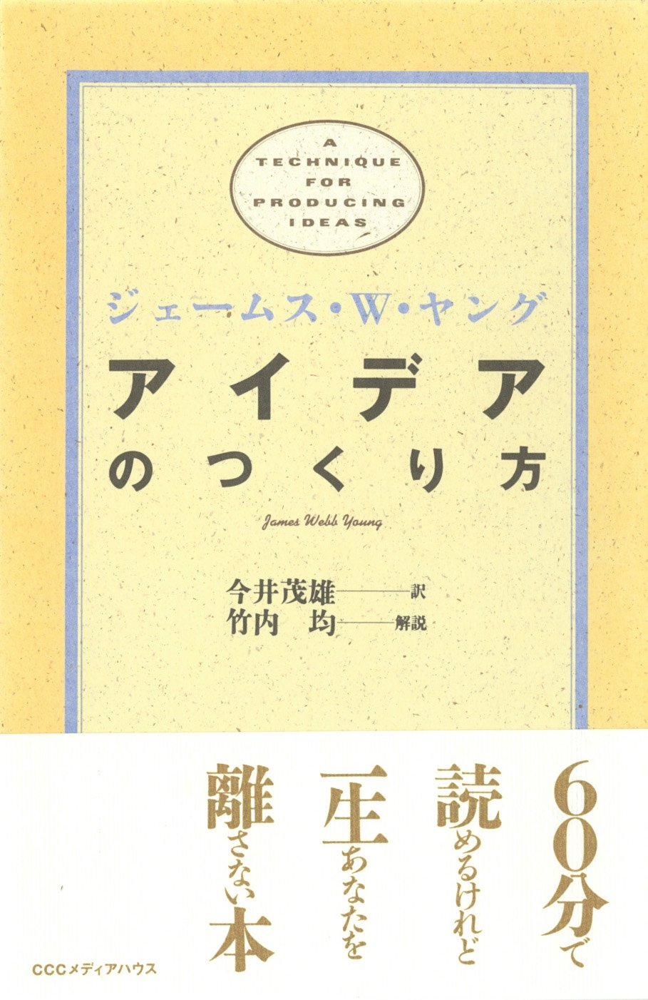

# アイデアのつくり方

- 著者: ジェームス W.ヤング 
- 出版社: CCCメディアハウス
- 版: 初版第73刷
- ISBN: 978-4-484-88104-1
- URL:
- 読み始め: 2026-08-14

---

## p.XX 一行要約

- 日付: YYYY-MM-DD
- status: 未回収

---

## p.XX 一行要約

- 日付: YYYY-MM-DD

---
