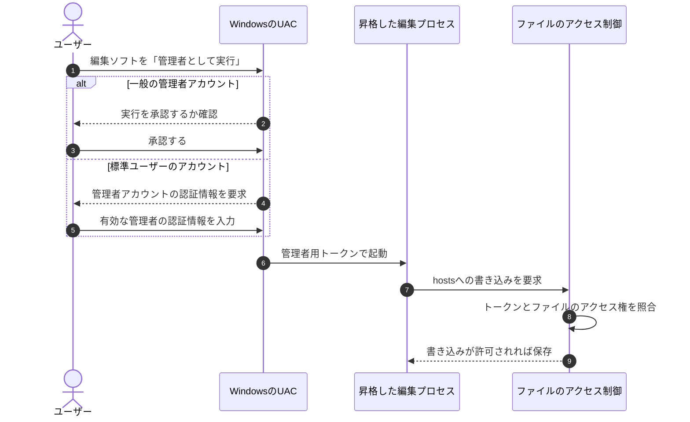

# 『おうちで学べるセキュリティの基本』2026-10-5 疑問13・14：Windowsの管理者権限とUAC

## 疑問

> 13. hostsファイルを書き換えるときに、管理者権限が出るが、これはウィルスによって管理者権限を奪うことができるのか？
> 14. Windowsの管理者権限とは、Linuxでいうroot権限？？

## 回答

**「PC全体を管理するための強い権限」という役割は、Linuxのroot権限に近いです。** ただし、Windowsでは、**管理者グループに属するアカウント**と、**管理者権限で実行されるプロセス**を区別します。管理者としてログインしていても、UACが有効な通常の構成では、普段のアプリは制限された権限で動きます（[Microsoft：UACとログイン時のアクセストークン](https://learn.microsoft.com/en-us/windows/security/application-security/application-control/user-account-control/how-it-works)）。

疑問13の「管理者権限が出る」は、通常、**UACの昇格確認が表示される**ことを指します。これはマルウェアの安全性を認定する画面ではなく、そのアプリを高い権限で実行するか確認する画面です。権限を悪用する経路は[hosts改ざんの説明](./basic_security_at_home_20261005_question13_hosts_tampering.md)にまとめています。

ここでは、そのWindows PCの**ローカル管理者権限**を扱います。

## 1. 「管理者」はアカウントの立場、「昇格」は実行中の状態

| 用語 | 意味 | 初学者が間違えやすい点 |
| --- | --- | --- |
| 標準ユーザー | 通常の作業を行うユーザー | 自分の文書の編集など、許可された操作はできる |
| Administratorsグループのメンバー | PCの管理作業を行えるアカウント | 起動したアプリが常に管理者権限を使うとは限らない |
| 管理者として実行されたプロセス | 管理者用の権限を持つトークンで動くアプリ | その実行中のアプリが、強い権限を使う |
| 組み込みのAdministratorアカウント | Windowsにある特定の管理者アカウント | 管理者グループに属する全ユーザーの総称ではない |

**自分が管理者でも、通常起動したメモ帳にはhostsの書き込み権限が足りない場合があります。** 「自分のアカウントの種類」だけでなく、「そのメモ帳がどの権限で動いているか」を確認する必要があります。

この説明は、一般の管理者アカウントで**UACの管理者承認モードが有効**な場合を想定しています。組み込みのAdministratorアカウントや、UACを無効化した構成には、実行・確認の動作が異なる設定があります（[Microsoft：UACの構成と組み込みAdministratorの設定](https://learn.microsoft.com/en-us/windows/security/application-security/application-control/user-account-control/settings-and-configuration)）。

## 2. Windowsは何を見て権限を判定するのか

Windowsは、プロセスやスレッドに対応する**アクセストークン**を使って、実行者の身元と権限を確認します。トークンには、ユーザー・グループを識別するSIDや、利用できる特権などが含まれます。SIDは、Windowsがアカウントなどを識別するためのIDです（[Microsoft：アクセストークン](https://learn.microsoft.com/en-us/windows/win32/secauthz/access-tokens)）。

```text
アプリのアクセストークン       ファイル側のアクセス権
「誰として、どの権限で動くか」  「誰に、読み書きを許すか」
               ＼               ／
                ＼             ／
                 Windowsが照合
                       │
                許可または拒否
```

ファイル側では、**DACL**というアクセス制御リストが、どのユーザー・グループに操作を許可・拒否するかを指定します。したがって、すべての操作が「管理者かどうか」だけで決まるわけではありません。通常のファイル操作は対象のアクセス権を、管理用の操作は必要な特権なども確認します（[Microsoft：アクセス制御の構成要素](https://learn.microsoft.com/en-us/windows/win32/secauthz/access-control-components)）。

トークンは、普通のアプリが文字列を「管理者」と書き換えれば権限を増やせるものではありません。例えば、Windowsの `AdjustTokenPrivileges` は、既にトークンにある特権を有効・無効にするAPIであり、新しい特権を付与するAPIではありません（[Microsoft：トークン操作APIの制約](https://learn.microsoft.com/en-us/windows/win32/secauthz/access-tokens)）。

## 3. UACの確認から、hostsを編集するまで

次は、編集ソフトを明示的に「管理者として実行」する場合の概念図です。既存の通常プロセスの権限を、ファイルごとに切り替える図ではありません。**高い権限の編集プロセスを起動する**流れとして読みます。



この図は**承認・認証が成功した場合**です。拒否した場合、または管理者の認証情報を提供できない場合、要求した管理者としての起動は行われません。具体的な表示や、標準ユーザーの昇格を許すかどうかは、組織のポリシーでも変わります（[Microsoft：UACの確認・認証ポリシー](https://learn.microsoft.com/en-us/windows/security/application-security/application-control/user-account-control/settings-and-configuration)）。

標準ユーザーが管理者の認証情報を入力する場合、実行するアプリはその**管理者アカウントの権限**を使います。標準ユーザーのアカウント自体が、以後ずっと管理者に変更されるわけではありません。

また、いったん高い権限で起動したアプリでは、同じ権限で行う操作のたびにUACが出るわけではありません。そのアプリが通常の方法で起動した子プロセスも、親のトークンを引き継ぐ場合があります。例えば、管理者として動くターミナルからプログラムを起動すると、そのプログラムも高い権限を持ち得ます（[Microsoft：UACと親子プロセスのトークン継承](https://learn.microsoft.com/en-us/windows/security/application-security/application-control/user-account-control/how-it-works)）。

## 4. UACがあれば、マルウェアの昇格は必ず防げるのか

**必ず防げるとはいえません。** UACは、意図しない管理操作を減らすための重要な防御です。一方、Microsoftは通常のUACを、独立した安全性を保証する「セキュリティ境界」ではなく、追加の防御として分類しています（[Microsoft MSRC：Windowsのセキュリティ境界とUACの分類](https://www.microsoft.com/en-us/msrc/windows-security-servicing-criteria)）。

ここでいうセキュリティ境界は、例えば「権限のないユーザーが、許可なく他のユーザーやカーネルのデータを改ざんできない」といった、OSが守るべき分離です。**同じ管理者アカウントの制限付き実行から昇格するUACの回避**と、**本来管理者ではないユーザーから管理権限を不正に得る攻撃**は、同じものとして扱いません。

| 分けて考えること | 意味 |
| --- | --- |
| UACの承認 | ユーザーが高い権限での実行を許可する。悪意あるアプリを承認しても、権限が渡り得る |
| UACの回避 | 管理者アカウントの制限付き実行などから、確認を経ず高い権限を使おうとする |
| 権限昇格の脆弱性の悪用 | 通常ユーザーなど、本来その権限を持たない状態から、OS等の欠陥で高い権限を取得する |

**UACを維持することに加えて、普段の標準ユーザー利用と脆弱性の修正を組み合わせる**のが大切です。「UACの画面を見ていないから、攻撃者は高い権限を持っていない」とは判断できません。

Windows 11には、追加の**Administrator protection（管理者保護）**という機能もあります。有効な構成では、分離されたシステム管理アカウントによる昇格やWindows Helloでの本人確認を使うため、上記の従来のUACとは内部動作が異なります。利用可否や有効状態は、その端末のバージョン・設定を確認します（[Microsoft：Administrator protection](https://learn.microsoft.com/en-us/windows/security/application-security/application-control/administrator-protection/)）。

## 5. SYSTEMはAdministratorと同じか

**別のアカウントです。** `NT AUTHORITY\SYSTEM`（LocalSystem）は、Windowsのサービスなどが使う、ローカルPCで非常に強い権限を持つ実行主体です。通常のログインユーザーの管理者アカウントとは用途が異なります（[Microsoft：LocalSystemアカウント](https://learn.microsoft.com/en-us/windows/win32/services/localsystem-account)）。

| 実行主体 | 主な用途 | 理解しておきたい点 |
| --- | --- | --- |
| Administratorsグループのユーザー | 人がPCを管理する | 実行時に、制限付きトークンか管理者用トークンかを区別する |
| SYSTEM／LocalSystem | OSやサービスがPC全体の処理を行う | ログインユーザーとは別の強い実行主体 |

「標準ユーザー → Administrator → SYSTEM」という単純な数字の階級だけでは、Windowsの権限を正確に表せません。どの実行主体・特権を持ち、対象のアクセス権がどう設定されているかが関係します。

Linuxとの具体的な比較は、[rootとsudoの説明](./basic_security_at_home_20261005_question14_linux_root_sudo.md)にまとめています。

**覚え方：** Windowsでは、「管理作業を行えるアカウントか」と「いま実行中のアプリが管理者権限を使っているか」を分けます。`hosts` を編集する際の確認画面は、後者の権限を使うための確認です。

調査日：2026-10-06。本文のリンクはMicrosoftの公式資料への参照です。
