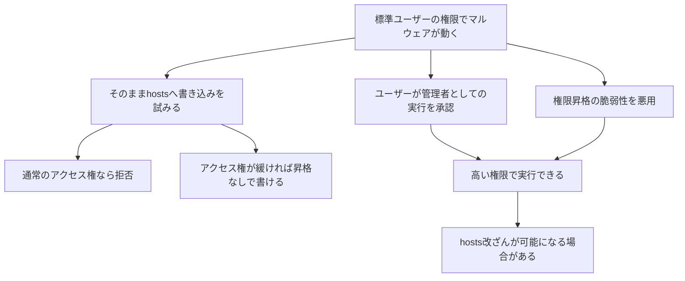

# 『おうちで学べるセキュリティの基本』2026-10-5 疑問13：hostsファイルの改ざんとマルウェアの権限

## 疑問

> hostsファイルを書き換えるときに、管理者権限が出るが、これはウィルスによって管理者権限を奪うことができるのか？

## 回答

**はい。マルウェアが脆弱性を悪用して高い権限を取得することはあります。** ただし、感染しただけで必ず管理者権限を得るわけではありません。ユーザーが悪意あるアプリを管理者として実行してしまう場合や、既に高い権限で動くプログラムを乗っ取る場合もあります。**「権限を不正に取得した」のか「既にある権限を悪用した」のかを分ける**と理解しやすくなります（[Microsoft：UACの概要](https://learn.microsoft.com/en-us/windows/security/application-security/application-control/user-account-control/)、[Microsoft：権限昇格の脆弱性が実際に悪用された事例](https://www.microsoft.com/en-us/security/blog/2025/04/08/exploitation-of-clfs-zero-day-leads-to-ransomware-activity/)）。

ここでは、質問の「ウィルス」を含め、悪意あるソフトウェア全般を**マルウェア**と呼びます。

## 1. hostsは何をするファイルか

`hosts` は、**ホスト名とIPアドレスの対応を、そのPCの中で指定するファイル**です。Windowsの通常の保存場所は次のとおりです。Windowsのインストール先が別なら、先頭のパスも変わります（[Microsoft：hostsの役割・保存場所](https://support.microsoft.com/en-us/windows/experience/how-to-reset-the-hosts-file-back-to-the-default)）。

```text
C:\Windows\System32\drivers\etc\hosts
```

例えば、次の1行を登録したとします。ホスト名とIPアドレスは説明用で、実際のサービスではありません。

```text
203.0.113.66    login.example.com
```

これは「このPCでは、`login.example.com` の接続先を `203.0.113.66` として扱う」という指定です。`hosts` の対応が使われる場合、DNSから本来得られる接続先と異なるIPへ接続させられます。**外部のDNSサーバーを書き換えるわけではありません。** また、すべてのアプリが必ずこのファイルを参照するわけでもなく、WindowsのDNS問い合わせAPIにも参照を省く指定があります（[Microsoft：Windowsの名前解決とhosts](https://learn.microsoft.com/en-us/windows-server/networking/dns/queries-lookups)、[Microsoft：`DNS_QUERY_NO_HOSTS_FILE`](https://learn.microsoft.com/en-us/windows/win32/dns/dns-constants)）。

```text
ユーザーが http://login.example.com/ を開く
                 │
                 ▼
PCの名前解決で、改ざんされたhostsの対応を使う
                 │
                 ▼
本来の接続先ではなく、攻撃者側のIPへ接続
                 │
                 ▼
攻撃者のサーバーが、ログイン画面に似せたページを返す
```

**変わるのは接続先IPです。アドレスバーのホスト名が自動で別の名前になるわけではありません。** そのため、入力したURLが正しく見えていても、HTTPでは別のサーバーへつながる可能性があります。

## 2. なぜ編集に管理者権限が必要なのか

Windowsでは、ファイルに設定された**アクセス権**と、編集する**プロセスの権限**を照合して、書き込みを許可するか決めます。プロセスは「実行中のプログラム」のことです。通常の保護された設定では、標準ユーザーとして動くアプリは `hosts` へ書き込めません（[Microsoft：アクセストークンとアクセス制御](https://learn.microsoft.com/en-us/windows/win32/secauthz/access-control-components)、[Microsoft：hostsの変更時の管理者確認](https://support.microsoft.com/en-us/windows/experience/how-to-reset-the-hosts-file-back-to-the-default)）。

| 確認するもの | 意味 | hosts編集との関係 |
| --- | --- | --- |
| ファイル側のアクセス制御リスト（ACL） | 誰にどの操作を許すか | 読み取りと書き込みは別に許可できる |
| プロセス側のアクセストークン | どのユーザー・グループ・特権で動くか | 同じ編集ソフトでも、通常起動と管理者としての起動で結果が変わる |
| UAC（ユーザーアカウント制御） | 管理者権限での実行を承認・認証する仕組み | 高い権限で編集する操作につながる確認画面を出す |

**ファイルの保護を直接行うのはアクセス権の検査で、UACは高い権限での実行を確認する仕組みです。** 単に保存を試みたアプリでは、確認画面ではなく「アクセスが拒否されました」と表示されることもあります。UACの詳しい流れは[Windowsの管理者権限の説明](./basic_security_at_home_20261005_question13_14_windows_privileges_uac.md)を参照してください。

## 3. マルウェアはどうやって書き換えられるのか

次の表は、公式資料の権限・アクセス制御の説明を、`hosts` 改ざんに当てはめた概念例です。**書き込みを試すだけで、OSが自動的に管理者権限を渡すことはありません。**

| 経路 | 例 | 高い権限を新たに奪う必要はあるか |
| --- | --- | --- |
| ユーザーが管理者として実行する | 偽の便利ツールを起動し、UACで承認してしまう | 不正な昇格処理なしでも、承認されたアプリに管理者権限が渡る |
| 高い権限で動くプロセスを悪用する | 脆弱な管理用サービスを乗っ取り、その実行権限を使う | 既に高い権限を持つプロセスを利用する |
| 権限昇格の脆弱性を悪用する | OSやドライバーの欠陥を使い、通常ユーザーの実行権限から高い権限へ移る | 必要。これが典型的な不正な権限昇格 |
| ファイルのアクセス権が緩められている | `hosts` に標準ユーザーの書き込み権限が付けられている | 不要。ファイル側が書き込みを許してしまっている |

根拠：[Microsoft：UACによる実行の承認](https://learn.microsoft.com/en-us/windows/security/application-security/application-control/user-account-control/)、[Microsoft：LocalSystemで動くサービスの権限](https://learn.microsoft.com/en-us/windows/win32/services/localsystem-account)、[Microsoft：権限昇格の実例](https://www.microsoft.com/en-us/security/blog/2025/04/08/exploitation-of-clfs-zero-day-leads-to-ransomware-activity/)、[Microsoft：ファイルのアクセス制御](https://learn.microsoft.com/en-us/windows/win32/secauthz/access-control-components)。



### 実際に権限を取得した事例

Microsoftは2025年4月、WindowsのCLFSというカーネルドライバーの脆弱性 **CVE-2025-29824** が、侵入後の攻撃で悪用されたと報告しています。通常ユーザーとして動く攻撃コードが高い権限を得て、SYSTEMのプロセスへコードを注入する活動が確認されました。修正プログラムは2025年4月8日に公開されています（[Microsoft Security Blog：CLFSの脆弱性と攻撃の分析](https://www.microsoft.com/en-us/security/blog/2025/04/08/exploitation-of-clfs-zero-day-leads-to-ransomware-activity/)）。

この報告は `hosts` 改ざんの事例そのものではなく、**「通常ユーザーの権限から、脆弱性で高い権限を取得することが実際にある」**ことの根拠です。脆弱性が悪用できる条件はWindowsのバージョンなどにも依存します。

また、標準ユーザーの権限のままでも、そのユーザーが書き込める文書を改ざん・削除することは可能です。**管理者権限を取れないことと、被害を出せないことは別**です。アクセス制御は許可された操作かを判断するもので、その操作の意図まで判定しません（[Microsoft：アクセス制御の判定対象](https://learn.microsoft.com/en-us/windows/win32/secauthz/access-control-components)）。

## 4. HTTPSなら、hostsの改ざんだけで偽サイトを信頼してしまうのか

**適切に証明書を検証するHTTPSでは、接続先IPを変更するだけでは正規サイトになりすませません。** ブラウザーは、接続したIPとは別に、URLのホスト名に対してサーバー証明書が正しいかを確認します。攻撃者が `login.example.com` に有効な、信頼された証明書と対応する秘密鍵を持たないなら、通常は接続を拒否するか、証明書エラーになります（[RFC 9525、6.1～6.3節：HTTPSの参照名と証明書の照合](https://www.rfc-editor.org/rfc/rfc9525.html#section-6.1)）。

| 状況 | hostsの改ざんによる影響 |
| --- | --- |
| TLSを使わないHTTP | 接続先を変えて、偽のページを返される可能性がある |
| 正しく証明書を検証するHTTPS | 正規ホスト名を証明できない偽サーバーを、証明書の検証で拒否できる |
| 端末側の信頼設定やブラウザーまで攻撃者に変更されている | 証明書検証の前提自体が壊され得るため、HTTPSだけでは安全を判断できない |

HTTPSは `hosts` への書き込みを止めません。**名前解決先の保護と、接続相手の証明書の検証は、異なる段階の対策**です。証明書エラーが出たら、そのまま先へ進んでよいと考えないことが大切です。

## 5. この疑問から押さえておきたい対策

- **普段は標準ユーザーで作業する。** 管理作業だけ別の管理者アカウントで行うと、常に高い権限を使う場面を減らせます（[Microsoft：標準ユーザーでの利用の推奨](https://learn.microsoft.com/en-us/windows/security/application-security/application-control/user-account-control/how-it-works)）。
- **意図していないUACの要求を承認しない。** 何を起動し、なぜ管理者権限が必要なのかを確認します。UACの確認はマルウェア検査の合格通知ではありません（[Microsoft：UACの役割](https://learn.microsoft.com/en-us/windows/security/application-security/application-control/user-account-control/)）。
- **OS・ドライバー・アプリを更新し、マルウェア対策を有効にする。** 既知の権限昇格の欠陥を修正し、悪意あるコードの実行を検出・抑制します（[Microsoft：CLFS攻撃への緩和策](https://www.microsoft.com/en-us/security/blog/2025/04/08/exploitation-of-clfs-zero-day-leads-to-ransomware-activity/)）。
- **保存エラーを解消するために、hostsを誰でも書ける設定へ変えない。** 必要な編集時だけ高い権限を使い、ファイルの書き込み制限を維持します。これはアクセス制御の仕組みから導かれる対策です。

Windowsでは、次のコマンドで `hosts` のアクセス権を表示できます。**設定は変更しません。** 実行する場所はPowerShellです（[Microsoft：`icacls` の表示機能](https://learn.microsoft.com/en-us/windows-server/administration/windows-commands/icacls)）。

```powershell
icacls "$env:windir\System32\drivers\etc\hosts"
```

**覚え方：** マルウェアにも実行権限の制約があります。`hosts` を改ざんするには、書き込みが許される権限を得るか、既に高い権限を持つ処理を悪用するか、ファイルの保護が緩い状態を利用する必要があります。

関連：[Windowsの管理者権限とUAC](./basic_security_at_home_20261005_question13_14_windows_privileges_uac.md)、[Linuxのrootとsudo](./basic_security_at_home_20261005_question14_linux_root_sudo.md)。

調査日：2026-10-06。本文のリンクは公式資料・仕様への参照です。
