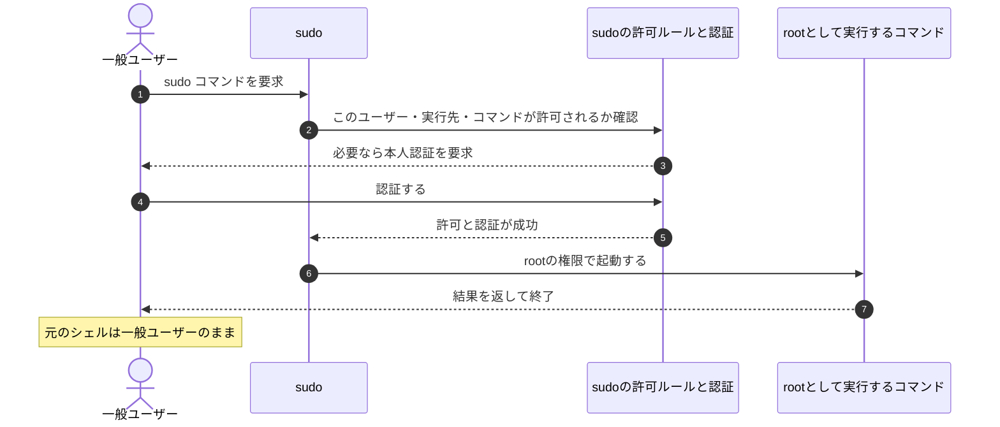

# 『おうちで学べるセキュリティの基本』2026-10-5 疑問14：Linuxのroot・sudoとWindows管理者の比較

## 疑問

> Windowsの管理者権限とは、Linuxでいうroot権限？？

## 回答

**役割は近いです。どちらも、通常ユーザーでは行えないPC全体の管理を行うための強い権限です。** ただし、Linuxの `root` はUIDが0の特別なユーザーを指し、Windowsの一般的な管理者はAdministratorsグループに属するユーザーです。さらに、WindowsではUACによってアプリの実行権限を区別します。**「管理者なら、常にrootで動くLinuxのシェルと同じ」とは考えない**ことが大切です（[Linuxマニュアル：rootと権限](https://man7.org/linux/man-pages/man7/capabilities.7.html)、[Microsoft：UACと管理者の実行権限](https://learn.microsoft.com/en-us/windows/security/application-security/application-control/user-account-control/how-it-works)）。

Windows側の詳しい仕組みは[Windowsの管理者権限とUAC](./basic_security_at_home_20261005_question13_14_windows_privileges_uac.md)を参照してください。

## 1. rootとは何か

Linuxはユーザーを**UID（User ID）という番号**で識別します。`root` は伝統的に、**UID 0を持つスーパーユーザー**です。通常の構成では、ソフトウェアのシステム全体へのインストール、ユーザー管理、保護された設定ファイルの編集などを行えます（[Linuxマニュアル：特権ユーザーのUID 0](https://man7.org/linux/man-pages/man7/capabilities.7.html)）。

また、ログインした人の名前だけでなく、**プロセスがどのユーザーIDで動くか**も重要です。権限の判定には実効UIDなどが使われます。Linuxのファイル操作では、通常は実効UIDと同じ値を持つファイルシステムUIDなどが使われます。まずは「実行中のプログラムにも、実行者のIDがある」と理解するとよいです（[Linuxマニュアル：プロセスのユーザーID](https://man7.org/linux/man-pages/man7/credentials.7.html)）。

| 状態 | 意味 | できることの例 |
| --- | --- | --- |
| 一般ユーザーとして実行 | 一般ユーザーのIDで動く | 自分が所有し、書き込みを許された文書を編集する |
| rootとして実行 | 通常のrootの権限を持つプロセスとして動く | 他のユーザーに書き込みを許していないシステム設定などを管理する |
| sudoを利用できる一般ユーザー | ルールで許されたコマンドを、別ユーザーとして実行できる | 必要なコマンドをrootとして実行する |

**sudoを利用できるユーザーも、普段のプログラムがすべてrootで動くわけではありません。** これは、Windowsでアカウントの種類と実行中の権限を分ける理解につながります。

## 2. sudoは「rootユーザー」ではなく、実行を仲介する仕組み

`sudo` は、許可されたユーザーが、**指定された別ユーザーの権限でコマンドを実行するためのコマンド**です。一般的には実行先がrootですが、別のユーザーを指定することもできます（[sudoのマニュアル：実行先ユーザーとセキュリティポリシー](https://man7.org/linux/man-pages/man8/sudo.8.html)）。

例えば次の確認を、sudoの使用を許可されたLinux環境で行うとします。表示されるUIDは例です。

```bash
id -u
# 例：1000（現在の一般ユーザー）

sudo id -u
# 例：0（このidコマンドはrootとして実行）

id -u
# 例：1000（元のシェルは一般ユーザーのまま）
```

**1つのコマンドをrootで実行しても、元のシェルやアカウントまでrootへ変わるわけではありません。** rootのシェルを起動すれば、そこから実行する処理は高い権限を引き継ぎ得ますが、上の例はUIDを表示するコマンドだけを実行しています。



この図は許可・認証が成功する概念例です。**パスワードを知っているだけでは、sudoの許可ルールを無視できません。** `sudoers` ポリシーでは、誰が、どのユーザーとして、どのコマンドを実行できるかを定めます（[sudoersのマニュアル：許可ルールと認証](https://man7.org/linux/man-pages/man5/sudoers.5.html)）。

### sudoで求められるのは、誰のパスワードか

Ubuntuの一般的な設定では、sudoは**sudoを実行した本人のパスワード**で認証します。rootのパスワードを毎回入力する仕組みではありません。Ubuntuではrootアカウントのパスワードによる直接ログインを既定で無効にし、管理作業にsudoを使う運用を採用しています（[Ubuntu公式：rootとsudoの運用](https://ubuntu.com/server/docs/how-to/security/user-management/)）。

ただし、sudoの設定によって認証先や要求の有無は変わります。直前の認証が有効な間や、パスワード不要と指定された場合には、入力を求められないこともあります。**「毎回パスワード画面が出ること」をセキュリティの前提にしません**（[sudoersのマニュアル：認証とキャッシュ](https://man7.org/linux/man-pages/man5/sudoers.5.html)）。

## 3. WindowsとLinuxの対応関係

次の表は、Microsoftの権限モデルとLinux・sudoの仕様を、用途で比較したものです。内部実装が同じという意味ではありません。

| 観点 | Windows | Linux |
| --- | --- | --- |
| 普段の作業 | 標準ユーザーの権限で動くアプリ | 一般ユーザーとして動くプロセス |
| 管理作業を行える立場 | Administratorsグループのユーザーなど | root、またはsudoで管理コマンドの実行を許可されたユーザー |
| 高い権限で動く状態 | 管理者用トークンで実行されたプロセス | rootの権限で実行されたプロセスなど |
| 必要なときに管理操作を行う手段 | 「管理者として実行」やUACによる昇格 | `sudo` で許可されたコマンドを実行 |
| 実行者の識別・権限情報 | SID、グループ、特権を含むアクセストークン | UID、GID、補助グループ、ケーパビリティなど |
| 通常のファイル操作の許可 | ファイルのDACLなど | 所有者・グループ・その他のアクセス権、ACLなど |

根拠：[Microsoft：アクセストークン](https://learn.microsoft.com/en-us/windows/win32/secauthz/access-tokens)、[Microsoft：アクセス制御](https://learn.microsoft.com/en-us/windows/win32/secauthz/access-control-components)、[Linux：プロセスのユーザーID](https://man7.org/linux/man-pages/man7/credentials.7.html)、[Linux：ケーパビリティ](https://man7.org/linux/man-pages/man7/capabilities.7.html)、[sudoのマニュアル](https://man7.org/linux/man-pages/man8/sudo.8.html)。

使い方の感覚としては、Windowsの「普段は制限された権限で動き、必要時に管理者としてアプリを起動する」は、Linuxの「普段は一般ユーザーで動き、必要時にsudoを使う」に近いです。

ただし、一般のWindows管理者がUACで承認する場合は、通常、同じユーザーの管理者用トークンを使います。一方、通常の `sudo コマンド` は、コマンドをrootなどの別ユーザーとして実行します。**UACとsudoは、目的が似ていても認証と実行主体の仕組みが異なります。**

## 4. Linuxでもhostsの書き換えにはrootが必要なのか

Linuxの通常の `hosts` は `/etc/hosts` にあります（[Linuxマニュアル：hostsの保存場所と形式](https://man7.org/linux/man-pages/man5/hosts.5.html)）。例えば、次のような所有者・アクセス権なら、一般ユーザーは読み取れますが、書き込めません。これは説明用の設定例で、実際の権限は環境ごとに確認します。

```text
-rw-r--r--  root root  ... /etc/hosts
 │  │  │
 │  │  └─ その他のユーザー：読み取り
 │  └──── 所有グループ：読み取り
 └─────── 所有者root：読み取り・書き込み
```

この設定では、通常はrootとしての編集、またはsudoで許可された編集処理などが必要です。**ファイルに一般ユーザーの書き込み権限が付いていれば、rootを取得しなくても変更できます。** これはWindowsの `hosts` のアクセス権が緩められた場合と共通する考え方です。

権限を確認するには、Linuxの端末で次を実行します。ファイルの設定は変更しません。

```bash
ls -l /etc/hosts
```

マルウェアも、通常は実行中のプロセスに与えられた権限の範囲で動きます。rootで悪意あるプログラムを実行してしまった場合や、権限昇格の欠陥がある場合は、この保護が破られる可能性があります。

## 5. 補足：rootは、どんな環境でも絶対に何でもできるのか

**現在のLinuxでは、UID 0という番号だけで、あらゆる操作が無条件に成功するとは限りません。** Linuxには、rootが伝統的に持っていた権限を分割する**ケーパビリティ**があります。権限を削減したプロセスや、ユーザー名前空間によって範囲を分離した環境では、rootとして見えても操作が制限され得ます（[Linuxマニュアル：ケーパビリティとユーザー名前空間](https://man7.org/linux/man-pages/man7/capabilities.7.html)）。

初学者の段階では、まず**「通常のrootは非常に強い管理権限を持つ。ただし実際の権限はプロセスの設定や実行環境にも依存する」**と押さえれば十分です。Windowsでも、管理者かどうかだけでなく、実行時のトークンと対象のアクセス権が関係します。

**覚え方：** Windowsの管理者とLinuxのrootは、PC全体を管理する役割が近いです。日常の作業と管理作業を分ける方法として、WindowsにはUAC、Linuxにはsudoなどがあります。どちらでも、**いま実行するプログラムにどの権限を渡すか**が大切です。

関連：[hosts改ざんとマルウェアの権限](./basic_security_at_home_20261005_question13_hosts_tampering.md)、[Windowsの管理者権限とUAC](./basic_security_at_home_20261005_question13_14_windows_privileges_uac.md)。

調査日：2026-10-06。本文のリンクはMicrosoft・Ubuntuの公式資料と、Linux／sudoのマニュアルへの参照です。
