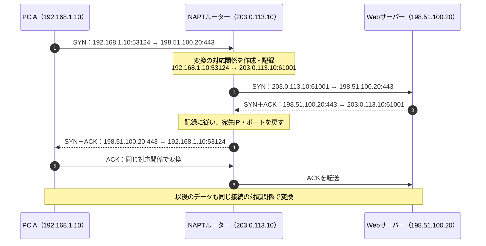
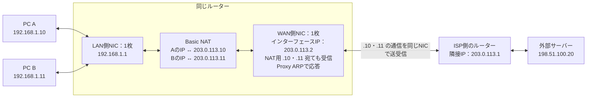
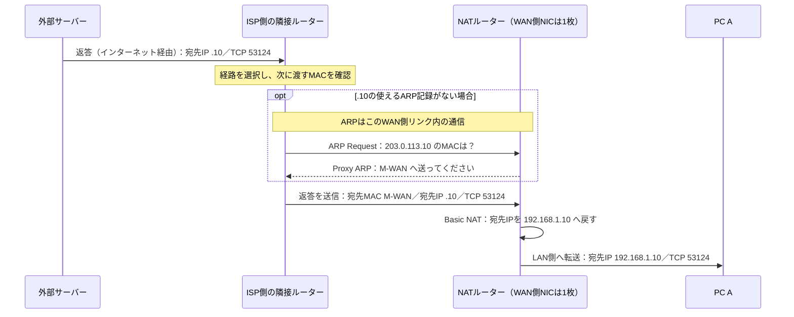

# 『おうちで学べるセキュリティの基本』2026-10-5 疑問15・16：NAT・NAPTと返答先の識別

## 疑問

> 15. NAT（アドレス変換って何？）
> - グローバルIPをローカルIPに変換するもの？
>
> 16. グローバルIPからローカルIPへデータを転送するのはルータの役目だと思うが、どのローカルIPに割り振るのか？識別方法は？MACアドレス？

## 回答

**NATは、中継するIPパケットのIPアドレスを、対応関係に従って書き換える仕組みです。** 家庭のIPv4通信では、行きの通信で「PCのプライベートIP → 外側で使うグローバルIP」、返答で「外側のグローバルIP → 元のPCのプライベートIP」と変換します。したがって、疑問15の理解は**返答の方向については合っていますが、行きの方向もあります**（[RFC 3022、2章・4.1節：NATの概要と変換対象](https://www.rfc-editor.org/rfc/rfc3022.html#section-2)）。

**複数のPCが一つのグローバルIPを共有する場合は、ポート番号も扱うNAPTが使われます。** 返答先は、ルーターが保持する**変換前後のIP・ポートの対応表**から特定します。外部サーバーから元のPCのMACアドレスが送られてくるわけではありません（[Cisco公式：NAT Overloadingと対応表の検索](https://www.cisco.com/c/en/us/td/docs/ios-xml/ios/ipaddr_nat/configuration/xe-2/nat-xe-2-book/iadnat-addr-consv.html)）。

この2つの疑問には、次の3つの技術が関係します。技術ごとに文書を分けています。

| 技術 | この疑問で担当すること | 解説 |
| --- | --- | --- |
| NAT・NAPT | 外側のIP・ポートを、元のPCのIP・ポートへ戻す | この文書 |
| IPルーティング | 宛先IPに届く経路・送信するインターフェースを選ぶ | [IPルーティング](./basic_security_at_home_20261005_question16_ip_routing.md) |
| ARP | 同じLANで次に渡す相手のIPv4アドレスからMACアドレスを調べる | [ARPとMACアドレス](./basic_security_at_home_20261005_question16_arp_mac_address.md) |

以下は**家庭用ルーターでIPv4のNAPTを使い、TCPで外部サーバーへ接続する例**です。図・表は仕様を基に作った説明用の例で、特定製品の設定や実測結果ではありません。

## 1. グローバルIPとプライベートIP

この文書では、質問の「ローカルIP」を、家庭のLANなどで使う**プライベートIPv4アドレス**という意味で扱います。

| 呼び方 | 意味 | この例での使い方 |
| --- | --- | --- |
| グローバルIP（パブリックIP） | インターネット上で配送に使えるアドレス | ルーターの外側のIP、外部サーバーのIP |
| プライベートIP | 組織・家庭などの内部で使うために予約されたアドレス | PC Aの `192.168.1.10`、PC Bの `192.168.1.11` |

プライベートIPv4の範囲は次の3つです。別々の家庭で同じアドレスを使えますが、**そのままインターネット全体の配送先には使えません**。一方、社内や家庭内では、プライベートIPを使ってルーティングできます（[RFC 1918、3章・5章：プライベートアドレスと経路情報](https://www.rfc-editor.org/rfc/rfc1918.html#section-3)）。

- `10.0.0.0` ～ `10.255.255.255`
- `172.16.0.0` ～ `172.31.255.255`
- `192.168.0.0` ～ `192.168.255.255`

なお、「ローカルIP」は文脈により意味が変わります。自分自身を指す `127.0.0.1` などのループバックアドレスと、ここで扱うプライベートIPは区別します。

## 2. NATとNAPTは何が違うか

| 用語 | 変換するもの | 対応関係の例 |
| --- | --- | --- |
| Basic NAT | IPアドレス | `192.168.1.10 ↔ 203.0.113.10`。同時に別のPCを接続するなら、別の外側IPへ対応付ける |
| NAPT（Network Address Port Translation） | IPアドレスと、TCP/UDPのポート番号など | `192.168.1.10:53124 ↔ 203.0.113.10:61001`。ポートなどで区別して、複数PCが外側IPを共有できる |

RFC 3022は両方をNATとして説明しています。そのため、家庭用ルーターの説明で単に「NAT」と書かれていても、ポートを扱うNAPTまで含むことがあります（[RFC 3022、概要・2章：Basic NATとNAPT](https://www.rfc-editor.org/rfc/rfc3022.html)）。

NAPTは、Ciscoなどでは **PAT（Port Address Translation）**、**NAT Overloading** とも呼ばれます（[Cisco公式：NAT FAQのPAT・Overloadingの説明](https://www.cisco.com/c/en/us/support/docs/ip/network-address-translation-nat/26704-nat-faq-00.html)）。

以下の `IP:ポート` は、例えば `192.168.1.10:53124` なら「IPアドレスが `192.168.1.10`、TCPポート番号が `53124`」という意味です。

## 3. 2台のPCが同じサーバーへ接続する例

```text
家庭のLAN                         家庭用ルーター                インターネット

PC A  192.168.1.10 ──┐          LAN側: 192.168.1.1
                    ├───────── [ NAPTを行う ] ───────── 外部Webサーバー
PC B  192.168.1.11 ──┘          WAN側: 203.0.113.10       198.51.100.20:443
```

LANは家庭内などのネットワーク、WANはこの図ではインターネットへ向かう側です。**ルーターは内側・外側で異なるIPアドレスを持ちます。** ここではWAN側にグローバルIPv4がある構成を想定します。

`203.0.113.10` と `198.51.100.20` は実際の接続先ではなく、グローバルIPの役割を示す**文書用アドレス**です（[RFC 5737：文書用IPv4アドレス](https://www.rfc-editor.org/rfc/rfc5737.html)）。

### 行き：PCの送信元IP・ポートを変換する

2台が、たまたま同じ送信元ポート `53124` を使ったとします。**同じ番号を使うのは、この説明例の条件です。「同じポートになったときだけNAPTを使う」という意味ではありません。**

| 通信 | ルーターへ届く前の送信元 | NAPT後の送信元 | 宛先 |
| --- | --- | --- | --- |
| PC Aから | `192.168.1.10:53124` | `203.0.113.10:61001` | `198.51.100.20:443` |
| PC Bから | `192.168.1.11:53124` | `203.0.113.10:61002` | `198.51.100.20:443` |

この例では、外側のポートを別々にすることで、同じ外側IPから同じサーバーへ向かう通信を区別しています。サーバーから見ると、接続元は同じIPでもポートが異なります。

- `53124`：PC側がその接続で使うポート。
- `443`：この例のWebサーバー側の受付ポート。
- `61001`・`61002`：ルーターが外側の通信に使うポートの例。

**NAPTで必ずポート番号が変わるわけではありません。** 元の番号を維持できる場合もあり、その通信もNAPTの対応表で管理します。ここでは変換が見えるように別の番号を使っています（[RFC 4787、4.2.1節：ポートの維持と衝突](https://www.rfc-editor.org/rfc/rfc4787.html#section-4.2.1)）。

### 返答：対応表を使って、元のPCへ戻す

ルーターは、例えば次のような変換・接続の記録を保持します。表示形式は製品によって異なります。

| プロトコル | 内側のIP・ポート | 外側のIP・ポート | 通信相手のIP・ポート |
| --- | --- | --- | --- |
| TCP | `192.168.1.10:53124` | `203.0.113.10:61001` | `198.51.100.20:443` |
| TCP | `192.168.1.11:53124` | `203.0.113.10:61002` | `198.51.100.20:443` |

```text
Webサーバーからの返答

198.51.100.20:443 → 203.0.113.10:61001
                          │ ルーターが記録を照合
                          └→ 宛先を 192.168.1.10:53124 に戻す → PC A

198.51.100.20:443 → 203.0.113.10:61002
                          │ ルーターが記録を照合
                          └→ 宛先を 192.168.1.11:53124 に戻す → PC B
```

**返答が来てから空いているPCへ割り振るのではなく、行きの通信で記録した対応関係へ戻します。** また、NAPT後も最終的にPCへ渡す際には、元のPC側のポートへ戻すため、その接続を待っている処理へ届きます（[Cisco公式：NAT Overloadingの返答処理](https://www.cisco.com/c/en/us/td/docs/ios-xml/ios/ipaddr_nat/configuration/xe-2/nat-xe-2-book/iadnat-addr-consv.html)）。

MACアドレスを使うのは、ここで特定したPCへ**LAN内で配送する段階**です。詳しくは[ARPの文書](./basic_security_at_home_20261005_question16_arp_mac_address.md)で扱います。

## 4. 対応表は、いつ作り、何を記録するのか

次は、PC Aから始めるTCP通信の概念図です。NAPTによる変換を説明するため、MACアドレスとファイアウォールの判定は省いています。



この図は新しい対応関係を作る例です。実装や通信条件によって、既存の対応関係を再利用する場合もあります。TCPでは最初のSYNから変換が必要であり、**TCPの接続確立が終わってから記録し始めるわけではありません**（[RFC 5382、4.1～4.2節：TCPの変換記録](https://www.rfc-editor.org/rfc/rfc5382.html#section-4.1)）。

対応表については、次を押さえます。

- **プロトコルも関係する。** TCPの `61001` とUDPの `61001` は区別して扱えます。
- **一つのPCが複数の対応関係を持てる。** 別の接続を始めれば、その通信に合う記録が必要です。「PC Aは永久に61001番」と決まるわけではありません。
- **動的な記録は一時的。** 通信終了や一定時間の無通信などに応じて削除されます。製品の設定や通信状態によって寿命は異なります。

プロトコルの扱いは[RFC 7857、5章](https://www.rfc-editor.org/rfc/rfc7857.html#section-5)、TCPの時間切れは[RFC 5382、5章](https://www.rfc-editor.org/rfc/rfc5382.html#section-5)で説明されています。対応表は転送用の状態であり、過去の通信をずっと残すログとは目的が異なります。

**「ポート番号だけで、どんな通信でも識別できる」とは覚えません。** 基本となる情報は、プロトコル、送信元IP・ポート、宛先IP・ポートです。先ほどの例では外側の宛先ポートが違うので見分けやすいですが、通信相手が異なれば外側のポートを共有できる実装もあります（[RFC 7857、3章：5つの情報と外側ポートの共有](https://www.rfc-editor.org/rfc/rfc7857.html#section-3)）。

なお、ここでのポート番号の説明はTCP/UDPを対象にしています。ICMPの問い合わせなどにはTCP/UDPのポートがなく、別の識別子を変換する場合があります（[RFC 3022、2.2節：ICMP問い合わせの識別子](https://www.rfc-editor.org/rfc/rfc3022.html#section-2.2)）。

## 5. 外から新しく接続する場合は、どう決めるか

これまでの例は**内側から始めた通信への返答**です。外部の人が家庭のサーバーへ**新しい接続を始める場合**は、固定の転送設定などを使って、転送先を指定できます。代表例が**ポート転送（ポートフォワーディング）**です。

| 条件 | 転送先の例 |
| --- | --- |
| WAN側IP `203.0.113.10` のTCP `8443` 番へ届く | LAN内サーバー `192.168.1.50` のTCP `443` 番へ転送 |

```text
外部クライアント
      │ 宛先 203.0.113.10:8443
      ▼
家庭用ルーター
      │ 固定ルールにより宛先IP・ポートを変換
      ▼
LAN内サーバー 192.168.1.50:443
```

このように、外側のポートと内側のポートは同じでなくても構いません。設定の条件に合う接続は、指定した内側の宛先へ向かいます。宛先を書き換える変換は**DNAT（Destination NAT）**と呼ばれ、ポート転送はその利用例です（[Netfilter公式：nftablesのDNATとポートの指定](https://netfilter.org/projects/nftables/manpage.html)）。外から始める通信の静的な対応付けは[RFC 3022、2.2節](https://www.rfc-editor.org/rfc/rfc3022.html#section-2.2)で説明されています。

| 到着した通信 | 転送先を決める根拠 |
| --- | --- |
| 内側から始めた通信への返答 | その通信の動的な変換・接続記録 |
| ポート転送で公開したサービスへの新規接続 | あらかじめ設定したIP・ポートの転送ルール |
| 対応する記録も転送ルールもない通信 | この例のNAPTでは、内側の特定PCへの転送先が定まらない |

最後の行は「ルーター宛ての通信はすべて破棄される」という意味ではありません。ルーター自身が提供するサービス宛ての場合は、ルーターが受け取ることもあります。また、既存の変換記録を外部からの新規接続に使えるかは、受信の制御方針によって変わります（[RFC 5382、4.3節：外から開始する接続](https://www.rfc-editor.org/rfc/rfc5382.html#section-4.3)）。

## 6. NATとファイアウォールは、役割を分けて考える

| 機能 | 判断すること |
| --- | --- |
| NAT・NAPT | どのIP・ポートへ変換するか |
| ファイアウォール・フィルタリング | その通信を許可するか、拒否するか |

**転送先が分かることと、その通信を通してよいことは別です。** ポート転送の設定があっても、ルーターや受信端末のファイアウォール、サービス側の設定が通信を許可する必要があります。

動的な変換記録がない通信を内側へ届けにくいことには防御上の効果があります。しかし、**IPアドレスを書き換えること自体は、通信の暗号化やマルウェアの検査ではありません**。受信をどう制限するかを明示的に設計します（[RFC 4787、4.1節・5章：変換とフィルタリングの区別](https://www.rfc-editor.org/rfc/rfc4787.html#section-5)、[RFC 4864、2.2節：NATと保護の限界](https://datatracker.ietf.org/doc/html/rfc4864#section-2.2)）。

既存の[ステートフルインスペクションの解説](./basic_security_at_home_20261005_question7_stateful_inspection.md)も、接続記録を使います。例えばLinuxのnftablesでは、NATもconntrackという接続追跡の情報を利用します。それでも、「変換するための対応関係」と「許可・拒否の判断」は分けて理解します（[Netfilter公式：natチェーンとconntrack](https://netfilter.org/projects/nftables/manpage.html)）。

## 7. この説明を当てはめるときの補足

- **PCへプライベートIPを割り当てる処理は、NATではありません。** 自動割り当てにはDHCPなどを使い、手動設定もできます。NATは、すでにIPを持つPCの通信を中継するときに変換します（[RFC 2131、1章・2.2節：DHCPの役割](https://www.rfc-editor.org/rfc/rfc2131.html#section-1)）。
- **家庭用ルーターのWAN側に、必ずグローバルIPv4があるとは限りません。** ISP側でも変換するCGNATなどでは、家庭用ルーターより外側にもNATがあります。この場合、自宅だけでポート転送を設定しても、ISP側からの経路・変換が用意されなければ外から接続できません。CGNAT用の共有アドレス空間 `100.64.0.0/10` は、RFC 1918の3つの範囲とは別です（[RFC 6598、1～2章・7章：CGNATと共有アドレス空間](https://www.rfc-editor.org/rfc/rfc6598.html)）。
- **IPv6では、端末がグローバルアドレスを持ち、アドレス共有のNATを使わず通信できます。** その場合でも、外からの新規接続を制限するファイアウォールは使えます。「NATがないから外部へ無制限に公開される」とは限りません（[RFC 4864、概要・4.2節：NATなしでのIPv6の保護](https://datatracker.ietf.org/doc/html/rfc4864#section-4.2)）。

## 追加質問1：インターネット上のサーバーから見えるのはWAN側のIPか

> ルータにはLANとWANがあるようですが、インターネット上のサーバーから見えるのは、WANのIPアドレスですか？

**本文のように「ルーターのWAN側のグローバルIPv4へ変換し、途中でさらに変換しない」構成なら、その理解で合っています。** 外部サーバーが受け取る通信の送信元IPは、ルーターのWAN側IP `203.0.113.10` です。RFC 3022も、WAN側のIPを使って複数端末の通信を中継するNAPTの例を示しています（[RFC 3022、2.2節：WAN側アドレスを使うNAPT](https://www.rfc-editor.org/rfc/rfc3022.html#section-2.2)）。

ここで「見える」とは、**サーバーが受信したIPパケットの送信元アドレスとして分かる**という意味です。本文の例では次のようになります。

| 観測する場所 | PC Aからの通信の送信元 | PC Bからの通信の送信元 |
| --- | --- | --- |
| 家庭のLAN側（変換前） | `192.168.1.10:53124` | `192.168.1.11:53124` |
| ルーターのWAN側から出た後 | `203.0.113.10:61001` | `203.0.113.10:61002` |
| 外部サーバーが受け取るとき | `203.0.113.10:61001` | `203.0.113.10:61002` |

外部サーバーの接続元IPには、PC A・BのプライベートIPや、ルーターのLAN側IP `192.168.1.1` は現れません。**2台とも同じ外側IPに見え、通信はポート番号などでも区別されます。**

### WAN側IPと、サーバーから見えるIPが異なる場合

LAN・WANは、接続するネットワーク側の役割を示す呼び方です。**WAN側だから必ずグローバルIPとは限りません。** 例えば、ISPがCGNATを使う構成では、家庭用ルーターのWAN側に共有アドレスを設定し、ISP側でもアドレスを変換することがあります（[RFC 6598、1～2章：CGNATと家庭用機器の接続](https://www.rfc-editor.org/rfc/rfc6598.html#section-1)）。

次の図は、送信元IPの変化だけを示した説明用の例です。

```text
PC A              家庭用ルーター              ISP側のCGNAT           外部サーバー
192.168.1.10 ───→ WAN側 100.64.1.2 ─────────→ 外側 203.0.113.30 ───→ 198.51.100.20
                     │ 家庭で変換                  │ ISPでさらに変換

外部サーバーが受け取る送信元IP：203.0.113.30
家庭用ルーターのWAN側IP      ：100.64.1.2
```

この場合、サーバーから見えるのは**ISP側で最後に変換されたグローバルIP**です。図の `100.64.1.2` は、CGNAT用の共有アドレス空間に属し、グローバルに経路広告されるアドレスではありません。

また、NATの設定で**変換に使うIPの候補を別途指定する方式（アドレスプール）**もあります。この場合も、サーバーに見えるのは変換に選ばれたIPで、WANインターフェースに設定したIPと同じとは限りません（[Cisco公式：NAT FAQのアドレスプール・Overloadingの説明](https://www.cisco.com/c/en/us/support/docs/ip/network-address-translation-nat/26704-nat-faq-00.html)）。

IPv6で端末のグローバルアドレスを使い、NATなしで接続する構成では、送信元は**その端末自身のIPv6アドレス**です。ルーターで中継しても、送信元を必ずルーターのWAN側IPへ変換するわけではありません（[RFC 4864、概要：IPv6でNATを不要にする設計](https://datatracker.ietf.org/doc/html/rfc4864)）。

今回の家庭のIPv4の例では「WAN側IPが見える」で合っています。構成が変わる場合は、**サーバーへ届くまでに送信元IPがどう変換されたか**を確認します。

## 追加質問2：2台のPCのポートが違えば、NAPTからNATへ切り替わるのか

> NAPTが使用されている場合について、たまたま2台のPCが同じポートを使用した時にNAPTによる変換が行われるとのことでしたが、この2台のPCが同じポートを使用しなければNAT変換が行われるんですか？

**NAPTを使う構成なら、2台の送信元ポートが異なる場合もNAPTを使います。** 「同じポートならNAPT、違うポートならBasic NAT」と自動的に切り替える仕組みではありません。本文の同じポートの例は、**複数PCの通信を外側で区別する必要性**を示すためのものでした。

NAPTでは、対象の通信について**内側のIP・ポートと、外側のIP・ポートの対応関係**を管理します。TCPでは、内側から接続を始める時点で、その通信の対応関係を作成・再利用します（[RFC 5382、4.1～4.2節：接続ごとの変換記録](https://www.rfc-editor.org/rfc/rfc5382.html#section-4.1)）。

ここで混同しやすいのは、次の2つです。

| 分けて考えること | 意味 |
| --- | --- |
| NAPTを使うか | IPとポートの対応関係を使う方式で、この通信を変換・管理するか |
| ポートの番号を変えるか | 外側でも元のポート番号を使うか、別の番号を割り当てるか |

**番号が変わっていなくても、NAPTでIP・ポートの対応関係を管理していれば、NAPTを使った通信です。** 元のポート番号を外側でも使う動作を、**ポート維持（port preservation）**と呼びます（[RFC 4787、4.2.1節：ポート維持の定義](https://www.rfc-editor.org/rfc/rfc4787.html#section-4.2.1)）。

### 例A：2台の送信元ポートが違う場合

以下の例A・Bは、それぞれ独立した状態で考えます。どちらも、外側のIPは一つ、通信相手は同じ `198.51.100.20` のTCP `443` 番です。3章の表と異なり、ここでは**元のポート番号を可能な範囲で維持するNAPT**を想定します。

| PC | 内側のIP・送信元ポート | 外側のIP・送信元ポート | ポート番号の変更 | 使用する方式 |
| --- | --- | --- | --- | --- |
| A | `192.168.1.10:53124` | `203.0.113.10:53124` | なし | NAPT |
| B | `192.168.1.11:53125` | `203.0.113.10:53125` | なし | NAPT |

この例では外側の `53124` と `53125` を使用できるため、ポート番号を維持しています。**IPは2台とも同じ外側IPへ変換され、ポートの対応関係は記録されます。**

返答も、その記録を使って戻します。

```text
返答の宛先 203.0.113.10:53124 → 192.168.1.10:53124 → PC A
返答の宛先 203.0.113.10:53125 → 192.168.1.11:53125 → PC B
```

CiscoのPATの説明にも、通信が変換ルールに一致した後、元の送信元ポートを使えるか確認し、使える場合はその番号を割り当てる手順があります。**ポートを維持する場合も、PAT／NAPTの処理です**（[Cisco公式：NAT FAQの「How does PAT work?」](https://www.cisco.com/c/en/us/support/docs/ip/network-address-translation-nat/26704-nat-faq-00.html)）。

### 例B：2台の送信元ポートが同じ場合

| PC | 内側のIP・送信元ポート | 外側のIP・送信元ポート | ポート番号の変更 | 使用する方式 |
| --- | --- | --- | --- | --- |
| A | `192.168.1.10:53124` | `203.0.113.10:53124` | なし | NAPT |
| B | `192.168.1.11:53124` | `203.0.113.10:61002` | あり | NAPT |

内側ではIPが違うので、2台が同じポート番号を使っても区別できます。しかし、この例で2台とも外側を `203.0.113.10:53124` にすると、**同じTCPサーバーから見た接続のIP・ポートの組が重なります**。そのため、PC Bに別の外側ポートを割り当て、別々の接続として扱えるようにします（[RFC 5382、7.1節：同じ外部接続先でのポートの衝突](https://www.rfc-editor.org/rfc/rfc5382.html#section-7.1)）。

このように、同じ番号だった場合でも、**両方のPCのポートを必ず変更する必要はありません**。例BではPC Aの番号を維持し、PC Bだけを変更しています。通信相手が異なる場合などのポート共有については、4章の補足を参照してください。

なお、**2台の元のポートが異なれば、必ず番号を維持するという保証もありません。** すでに他の通信が外側の番号を使っていたり、実装が元の番号を維持しない割り当て方を採用していたりすれば、違う番号を使います。ポート維持の有無は実装・設定によって異なります（[RFC 4787、4.2.1節：ポートを維持しない動作](https://www.rfc-editor.org/rfc/rfc4787.html#section-4.2.1)）。

ここまでの「同じポート」は、**PC側の送信元ポート**を指します。例Aでも2台の宛先はサーバーのTCP `443` 番で同じですが、それだけで送信元ポートが衝突するわけではありません。

### 「NAT」という呼び方も整理する

2章のとおり、NATはNAPTも含む総称として使われます。

```text
NAT（広い意味：アドレス変換の総称）
├─ Basic NAT：IPアドレスを対応付ける
└─ NAPT     ：IPアドレスとポート番号などを対応付ける
              ├─ ポート番号を維持する場合
              └─ ポート番号を変更する場合
```

したがって、例Aについて「NATによるIP変換は行われるか」と聞けば、**行われます**。ただし、それは「NAPTをやめてBasic NATに切り替えた」という意味ではありません（[RFC 3022、2章：NATとNAPTの用語](https://www.rfc-editor.org/rfc/rfc3022.html#section-2)）。

Basic NATなら、例えばPC Aを `203.0.113.10`、PC Bを別の `203.0.113.11` へ対応付けます。これに対し、例A・Bでは2台が一つの外側IPを共有し、ポートも使って対応関係を管理します。**2台のポート番号が同じかどうかで決まるのは、主に番号の衝突への対処であって、変換方式を選ぶ条件ではありません。**

## 追加質問3：Basic NATのIPの対応付けと、NIC数・IPアドレス数の関係

> NAPTとBasic NATは切り替わるものではなく、そもそも別の方式であることはわかりました。
>
> そして、NAPTは1つのルータのIPに対して、PCごとにポートを分けて区別することはわかりました。では、NAT方式は、ポートで分けるのではなく、ルータの複数のIPにPCを対応付けるという認識であっていますか？
>
> ただし、この場合、ポートは増やせますが、IPはNICの数に限りがあると思うのですが、どうなんでしょうか？

**Basic NATについては、「内側のIPごとに、別の外側IPを対応付ける」という理解で合っています。** ここでも、プライベートIPv4からグローバルIPv4へ変換する基本的な構成を考えます。対応付けが有効な間は、内側と外側のIPが1対1になります（[RFC 3022、2.1節・3.1節：Basic NATの対応付け](https://www.rfc-editor.org/rfc/rfc3022.html#section-2.1)）。

一方、**IPアドレスの数は、NICの枚数と同じではありません。1枚のNICに対応するネットワークインターフェースで、複数のIPを扱えます。** また、NATの変換用IPは、すべてをWANインターフェース自身のIPとして設定するとは限りません。この2点を分けて説明します。

### 1. Basic NATでは、PCのIPと外側のIPを1対1で対応付ける

以下は、前のNAPTの例とは独立したBasic NATの例です。変換用に、2個の外側IP `203.0.113.10`・`203.0.113.11` を利用できるとします。

| PC | 内側のIP | 対応する外側のIP |
| --- | --- | --- |
| A | `192.168.1.10` | `203.0.113.10` |
| B | `192.168.1.11` | `203.0.113.11` |

2台が同じ外部サーバー `198.51.100.20:443` へ、同じ送信元ポート `53124` でTCP接続すると、送信元は次のようになります。

```text
PC A：192.168.1.10:53124 → 203.0.113.10:53124
PC B：192.168.1.11:53124 → 203.0.113.11:53124
                         ↑ IPが違うので、同じポート番号でも区別できる

返答の宛先 203.0.113.10:53124 → 192.168.1.10:53124 → PC A
返答の宛先 203.0.113.11:53124 → 192.168.1.11:53124 → PC B
```

Basic NATは、IPの対応関係を使って変換し、TCP／UDPのポート番号は変えません。**PCの中で複数の通信を区別するためのポートは、Basic NATでも使われます。** 「ポートを使わない通信になる」という意味ではありません（[RFC 3022、2章・4.1節：Basic NATが変更するヘッダー](https://www.rfc-editor.org/rfc/rfc3022.html#section-4.1)）。

対応する外側IPを決める方法には、次の違いがあります。ここでの静的・動的は、IP同士を対応付けるBasic NATの設定を指します。

| 対応付けの方法 | 外側IPの決め方 |
| --- | --- |
| 静的な対応付け（Static NAT） | 管理者が「Aは `.10`、Bは `.11`」のように、固定の対応を設定する |
| 動的な対応付け（Dynamic NAT） | 通信を始めるとき、変換用IPの候補の集合である**アドレスプール**から空いているIPを割り当てる。対応付けが解放された後は、別の内側IPに再利用できる |

プール内の外側IPが2個なら、**同時に対応付けられる異なる内側IPは最大2個**です。A・Bが両方を使用中にPC Cが通信を始めても、空きがなければ新しい対応付けを作れません。これだけでNAPTへ自動的に切り替わるわけではありません（[RFC 3022、2.1節・3.3節：プール内のIP数による制限と対応付けの解放](https://www.rfc-editor.org/rfc/rfc3022.html#section-3.3)）。

ただし、これは**同時接続が2本までという制限ではありません。** Aは、割り当てられた一つの外側IPで、複数のTCP接続を同時に使えます。同じ内側IPからの通信には、同じIPの対応付けを利用します（[RFC 3022、2.1節・3.1節：一つのIP対応で複数セッションを扱う](https://www.rfc-editor.org/rfc/rfc3022.html#section-3.1)）。

### 2. 1枚のNICで、複数のIPアドレスを扱える

まず、NIC・IP・ポートはそれぞれ役割が違います。

| 用語 | 役割 | 数を考えるときのポイント |
| --- | --- | --- |
| NIC（Network Interface Card） | 有線LANや無線LANなどを通じて、ネットワークとデータを送受信する装置 | 物理的な接続を担う。1枚につきIPが1個と決まっているわけではない |
| IPアドレス | IPの通信で、送信元・宛先を示す論理的なアドレス | 一つのネットワークインターフェースに、複数設定できる |
| TCP／UDPのポート番号 | IPアドレスと組み合わせて、通信やアプリケーションを区別する番号 | NICの差込口とは別の、ソフトウェアが扱う番号 |

例えばLinuxの `ip address` のマニュアルも、一つのネットワークデバイスに複数のIPv4／IPv6アドレスを設定できることを説明しています。**IPを追加するたびにNICを追加する必要はありません**（[iproute2のマニュアル：ip-address(8)のDESCRIPTION](https://man7.org/linux/man-pages/man8/ip-address.8.html#DESCRIPTION)）。

次の図は、WAN側NICが1枚でも、2個の変換用IPを利用できる構成例です。WANインターフェース自身のIPを `203.0.113.2`、変換用IPを `.10`・`.11` として、役割を分けて示しています。**「インターフェースIPが `.2`」という表示は、外側で使うIPが `.2` 一つだけという意味ではありません。**

この図では、WAN側の接続にEthernetを使い、ISP側の隣接IP `.1`、WANインターフェースのIP `.2`、変換用IP `.10`・`.11` が同じサブネット `203.0.113.0/24` にあるとします。**ルーターがProxy ARPにより `.10`・`.11` のARP問い合わせにも応答し、それらのIP宛ての返答を受け取る設定**を前提にしています（[Cisco公式：同じネットワークにあるNAT用IPとProxy ARP](https://www.cisco.com/c/en/us/td/docs/security/asa/asa923/configuration/firewall/asa-923-firewall-config/nat-reference.html)）。



外側へ出るパケットの送信元IPは、Aなら `.10`、Bなら `.11` です。**どちらも同じWAN側NICを通ります。** 「パケットの送信元IP」と「通過するインターフェース自身のIP」は、常に同じとは限りません。CiscoのNATプールの設定例でも、外側インターフェースのIPと、変換用のプールを別々に設定しています（[Cisco公式：NAT FAQの「What are NAT IP pools?」](https://www.cisco.com/c/en/us/support/docs/ip/network-address-translation-nat/26704-nat-faq-00.html)）。

### 3. NATの変換用IPには、そのルーターへ返答が届く仕組みも必要

**「1枚のNICに複数IPを設定できること」と、「NAT用の複数IPを利用すること」は、関連しますが同じ設定ではありません。** NAT機器によっては、変換用の全IPをインターフェースの追加IPとして設定せず、NATルールやプールで管理します。

その場合も、外部サーバーから `.10`・`.11` 宛てに返ったパケットを、そのルーターが受け取れる必要があります。代表的な仕組みは次のとおりです。

| 変換用IPとWAN側ネットワークの関係 | 返答をNAT機器へ届ける仕組み |
| --- | --- |
| 変換用IPが、WAN側の隣接ルーターと同じサブネットにある | NAT機器が、そのIPのARP問い合わせにも応答する。例えば**Proxy ARP（代理ARP）**により、複数IP宛てのパケットを同じWAN側NICのMACアドレスへ届ける |
| 変換用IPが、WAN側インターフェースとは別のサブネットにある | 上流のルーターに「このIP群へはNAT機器経由で送る」という経路を設定する。複数IP宛てのパケットを同じNAT機器へ転送する |

Cisco ASAの公式資料は、前者にはProxy ARP、後者には上流からNAT機器へ向けた経路が必要になることを説明しています。具体的な設定方法は機器・構成によって異なります（[Cisco公式：NAT Examples and Referenceの「Mapped Addresses and Routing」](https://www.cisco.com/c/en/us/td/docs/security/asa/asa917/configuration/firewall/asa-917-firewall-config/nat-reference.html)）。ARPと経路の基本は、それぞれ[ARPの解説](./basic_security_at_home_20261005_question16_arp_mac_address.md)・[IPルーティングの解説](./basic_security_at_home_20261005_question16_ip_routing.md)を参照してください。

つまり、必要なのは**IPごとのNICではなく、そのIP宛てのパケットをNAT機器へ届けられること**です。

ただし、**インターネットで使うグローバルIPを、設定だけで自由に増やせるわけではありません。** ISPなどから利用可能なIP群の割り当てを受け、そのIP群への返答が届く経路を用意します。Basic NATで使える外側IPの数を考えるときは、NICの枚数よりも、**利用できるIPの割り当てと、機器が対応する設定・処理上限**を確認します。RFC 3022のBasic NATの構成例も、NAT側に外側のアドレス群が割り当てられている前提です（[RFC 3022、2.1節：外側アドレス群の割り当て](https://www.rfc-editor.org/rfc/rfc3022.html#section-2.1)）。

### 4. 補足：NAPTは「PCごとにポートを一つ割り当てる」方式ではない

質問の前提も少し補足します。NAPTでは、**内側のIP・ポートと、外側のIP・ポートの組を対応付けます。** PC A専用の外側ポートを一つ決めて、Aの全通信をそこへまとめるわけではありません。同じPCでも、異なる送信元ポートを使う通信には、別の対応関係ができます（[RFC 3022、3.1節：NAPTのIP・ポートの対応付け](https://www.rfc-editor.org/rfc/rfc3022.html#section-3.1)）。

以下は、1個の外側IPを使うNAPTの独立した例です。宛先は、すべて同じサーバー `198.51.100.20:443`、プロトコルはTCPです。

| 通信 | 内側のIP・送信元ポート | 外側のIP・送信元ポート |
| --- | --- | --- |
| PC Aの接続1 | `192.168.1.10:53124` | `203.0.113.10:61001` |
| PC Aの接続2 | `192.168.1.10:53125` | `203.0.113.10:61002` |
| PC Bの接続1 | `192.168.1.11:53124` | `203.0.113.10:61003` |

この例では、**2台のPCに対して3個の外側ポート**を使います。また、NAPTは外側IPを1個だけ使う構成に限定されず、複数の外側IPを使うこともできます（[Cisco公式：NAT FAQの「How does PAT work?」](https://www.cisco.com/c/en/us/support/docs/ip/network-address-translation-nat/26704-nat-faq-00.html)）。

「ポートは増やせる」という点にも上限があります。TCP／UDPのポート番号は16ビットで、数値の範囲は `0～65535` です。そのすべてが自由に利用できるとは限らず、無限に番号を増やせるわけでもありません（[RFC 6335、3章・6章：ポート番号の役割と範囲](https://www.rfc-editor.org/rfc/rfc6335.html#section-6)）。ただし、IP・プロトコル・接続先なども通信の識別に関わるため、この範囲をそのまま「接続できるPCの台数」として数えることもできません。通信相手によるポートの再利用については、本文4章の補足も参照してください。

## 追加質問4：WAN側NICが1枚でも、2台分のBasic NATの返答を受け取れるか

> 「2. 1枚のNICで、複数のIPアドレスを扱える」の部分について、追加質問です。図でWANのNICについて、「WAN側NIC：1枚
> インターフェースIP：203.0.113.2」と書いてありますが、PCがAとB２台分のIPがWANにも必要な気がするのですが、どうですか？
> サーバーからのレスポンス時に困るような気がします。

**はい。このBasic NATの例では、PC A・B用の外側IPが2個必要です。図の `203.0.113.10` と `203.0.113.11` が、それに当たります。** `203.0.113.2` は、それらとは別の、ルーター自身のWANインターフェースに設定したIPです。元の図では、`.10`・`.11` 宛ての返答を受け取る設定条件が省略されていたため、上の図に補足しました。

### 1. ルーター側で使う外側IPは3個ある

| 外側のIP | この例での役割 | PCへの返答との関係 |
| --- | --- | --- |
| `203.0.113.2` | ルーター自身のWANインターフェースのIP。上流とのIP接続やルーター自身の通信に使う | この例のPC A・Bの通信は、このIPへ変換していない |
| `203.0.113.10` | Basic NATでPC Aの `192.168.1.10` と対応付ける外側IP | Aへの返答の宛先になる |
| `203.0.113.11` | Basic NATでPC Bの `192.168.1.11` と対応付ける外側IP | Bへの返答の宛先になる |

**このルーターがWAN側で利用するのは、PC用の外側IP2個を含む、この3個のIPです。WAN側NICは1枚で足ります。** インターフェース自身のIPと変換用IPの設定は、分けて管理できます。Basic NATの外側IPは、同時に対応付ける内側IPごとに必要です（[RFC 3022、2.1節：Basic NATの外側IPと同時利用数](https://www.rfc-editor.org/rfc/rfc3022.html#section-2.1)）。

サーバーが受け取った送信元が `.10` なら、返答の宛先も `.10` です。`.11` なら、返答の宛先は `.11` です。**この2台の返答が、両方とも `.2` 宛てになるわけではありません。**

### 2. 返答を同じWAN側NICへ届け、宛先IPで元のPCを識別する

上の図で補足した、同じサブネットとProxy ARPを使う構成で説明します。WAN側NICのMACアドレスを、説明用の記号で `M-WAN` と書きます。

PC Aへの返答は、次の順番で届きます。

1. **外部サーバーが返答する。** 宛先IPは `203.0.113.10`。インターネットの経路を通って、WAN側に隣接するISP側のルーターまで届きます。
2. **ISP側のルーターが、次に渡すMACを調べる。** この例では `.10` が同じサブネットなので、ARPで「`203.0.113.10` のMACは？」と問い合わせます。すでにARPの記録があれば、それを使います。
3. **NATルーターがProxy ARPで応答する。** `.10` をインターフェース自身の追加IPとして設定していなくても、NATの設定に基づき「`.10` 宛ては `M-WAN` へ」と応答する構成です。
4. **同じWAN側NICが返答を受け取る。** Ethernetフレームの宛先MACは `M-WAN`、その中のIPパケットの宛先は `203.0.113.10` です。ここまで、宛先IPを `.2` へ変える必要はありません。
5. **ルーターがBasic NATの対応表で戻す。** 宛先IPを `.10` から `192.168.1.10` に変換し、LAN側からPC Aへ転送します。TCPポート番号は、この例では `53124` のままです。

ARPは、同じネットワーク内でIPから次に渡す相手のMACを調べる仕組みです（[RFC 826：Packet Generationのアドレス解決](https://www.rfc-editor.org/rfc/rfc826.html)）。NAT用IPへのProxy ARPと、その返答を元の内側IPへ戻す動作は、Cisco ASAの公式資料にも示されています（[Cisco公式：NAT in routed mode／Mapped Addresses and Routing](https://www.cisco.com/c/en/us/td/docs/security/asa/asa923/configuration/firewall/asa-923-firewall-config/nat-reference.html)）。

PC Aへの返答を、問い合わせから転送まで図にすると、次のようになります。サーバーからISP側の隣接ルーターまでの矢印は、インターネット上の複数の区間をまとめています。ルーター内部の処理も、理解のために簡略化しています。



図の `.10` は `203.0.113.10` の略です。**ARPを問い合わせるのはISP側の隣接ルーターで、外部サーバーからARPを転送しているのではありません。** ARP Requestは通常、そのEthernetリンク内へのブロードキャストです。図では、受信する機器のうちNATルーターだけを描いています。使えるARP記録があれば、`opt` 内の問い合わせ・応答を省いて、返答を送ります（[RFC 826：対応表の確認とARP問い合わせ](https://www.rfc-editor.org/rfc/rfc826.html)）。

PC Bへの返答も、`.11` を使って同じように受け取ります。両方が同じポート `53124` を使っていても、宛先IPが違うため、対応表で区別できます。

| 返答 | WAN側で受け取る宛先IP・TCPポート | WAN側の宛先MAC | Basic NAT後の宛先IP・TCPポート |
| --- | --- | --- | --- |
| PC Aへ | `203.0.113.10:53124` | `M-WAN` | `192.168.1.10:53124` |
| PC Bへ | `203.0.113.11:53124` | `M-WAN` | `192.168.1.11:53124` |

**同じMAC・同じNICへ届いても、中に入っているIPの宛先は別々です。** MACでルーターのNICへ届け、IPとNATの対応関係で元のPCを特定します。Basic NATが返答の宛先IPを書き換えることは、RFC 3022の4.1節で説明されています（[RFC 3022、4.1節：返答の宛先IPの変換](https://www.rfc-editor.org/rfc/rfc3022.html#section-4.1)）。

### 3. 返答を受け取る設定がなければ、その懸念どおり届かない

**`.2` を設定してNATの対応表を作るだけでは、`.10`・`.11` 宛ての返答が届く保証はありません。** 上の構成では、利用可能な外側IPの割り当てと、`.10`・`.11` に対するProxy ARPの設定・動作が必要です。別のサブネットから変換用IPを使う構成なら、上流からNATルーターへ向けた経路を用意します（[Cisco公式：Mapped Addresses and Routingの同一・別サブネットの説明](https://www.cisco.com/c/en/us/td/docs/security/asa/asa923/configuration/firewall/asa-923-firewall-config/nat-reference.html)）。

質問の「2台分のIPがWANにも必要」という理解は、このBasic NATの例に当てはまります。その2個の外側IPを使い、返答を受け取れる設定を整えることで、**1枚のWAN側NICから2台へ戻せます。**

## 追加質問5：ARPを送らず、返答のIPパケットをそのまま送れないのか

> 「2. 返答を同じWAN側NICへ届け、宛先IPで元のPCを識別する」のシーケンス図について、外部サーバから「返答：IP宛先 203.0.113.10:53124」をISPのルータを介してNATルーターにARPを送信しているが、ここでARPを送らずに、そのまま「返答：IP宛先 203.0.113.10:53124」を送るのではダメなのか？
>
> ルータの中に「IP宛先 203.0.113.10:53124」の情報があれば、適切なコンピュータ（今回だったらPC A）に届けられる気がするがどうなのか？

**ISP側のルーターが、次に渡す相手のMACをすでに把握していれば、ARPを問い合わせずに返答を送れます。** 上の図の `opt` は「条件に当てはまる場合だけ実行する」という意味で、毎回ARPを送る必要はありません。RFC 826も、まずIPとMACの対応表を探し、見つかればそのMACで送信する流れを説明しています（[RFC 826：Packet Generation](https://www.rfc-editor.org/rfc/rfc826.html)）。

一方、**NATルーターの対応表に「`.10` はPC A」と記録されていることだけでは、ISP側からNATルーターへ届けるためのMACは分かりません。** 「返答をNATルーターへ届ける段階」と「届いた返答をPC Aへ戻す段階」は、別の処理です。

### 1. ARPは、返答の代わりに送るものではない

外部サーバーは、宛先IP `203.0.113.10`・宛先TCPポート `53124` の返答を送っています。**その返答をARPに変換しているわけではありません。** また、ARPを送るのは、図のWAN側に隣接するISP側のルーターです。外部サーバーのARPがインターネットを越えてNATルーターまで届く、という意味でもありません。

今回のWAN側はIPv4をEthernetで運ぶ構成です。Ethernetでは、IPパケットを、宛先MACなどを付けた**Ethernetフレーム**に入れて送ります。ISP側のルーターは、経路を選んだ後に、次に渡す相手のMACを得て、そのフレームを作ります（[RFC 1812、5.2.1.2節の手順5・10～11：経路・リンク層アドレス・フレーム](https://www.rfc-editor.org/rfc/rfc1812.html#section-5.2.1.2)）。

```text
ISP側のルーターが送るEthernetフレーム
  外側の宛先MAC：M-WAN                 ← ARP表などで分かる
  中の宛先IP   ：203.0.113.10          ← サーバーからの返答の宛先
  中のTCP宛先  ：53124                 ← PC Aが使っていたポート
  中のデータ   ：サーバーからの返答内容
```

MACが不明なら、ISP側のルーターはARPで問い合わせます。この問い合わせ・応答は、返答のIPパケットとは別の通信です。返答は短時間待たせ、MACが分かったらフレームに入れて送れます。ARPの間も、返答の宛先IPは `203.0.113.10` のままです（[RFC 1812、3.3.2節：ARPの問い合わせ中にパケットを待たせる処理](https://www.rfc-editor.org/rfc/rfc1812.html#section-3.3.2)）。

### 2. 「ルーターの中の情報」は、持つ機器と役割を分ける

| 情報 | 持つ機器 | この例で分かること |
| --- | --- | --- |
| 経路表 | ISP側のルーター | `203.0.113.10` へ送るインターフェースと、次に渡す相手 |
| WAN側のARP表 | ISP側のルーター | この構成では `203.0.113.10 → M-WAN`。Ethernetフレームの宛先MAC |
| Basic NATの対応表 | NATルーター | `203.0.113.10 ↔ 192.168.1.10`。返答の宛先をPC AのIPへ戻す対応 |
| LAN側のARP表 | NATルーター | `192.168.1.10 → PC AのMAC`。LAN側でPC Aへ渡すためのMAC |

根拠は、経路と次ホップのリンク層アドレスが別の処理であることを示す[RFC 1812、5.2.1.2節](https://www.rfc-editor.org/rfc/rfc1812.html#section-5.2.1.2)、IPとMACを対応付ける[RFC 826](https://www.rfc-editor.org/rfc/rfc826.html)、IPを対応付ける[RFC 3022、3.1～3.2節](https://www.rfc-editor.org/rfc/rfc3022.html#section-3.1)です。表の値は今回の構成例です。

質問の「NATルーターへ届けば、記録を使ってPC Aへ戻せる」という理解は合っています。**ARPが担当するのは、そこへ届けるためのMACを得る処理です。** ISP側に使えるARP記録があれば、その記録を使って返答を送れます。LAN側でも、使えるARP記録があれば、NATルーターはPC AのMACを再度問い合わせる必要がありません。

ここでのMACの話は、図で前提にしたEthernet区間についてです。すべてのWAN接続がARPを使うわけではなく、PPPのような別のリンク方式もあります（[RFC 1812、3.2節・3.3.5節：リンク方式による違い](https://www.rfc-editor.org/rfc/rfc1812.html#section-3.3.5)）。フレームとMACの詳細は、技術ごとに分けた[ARPとMACアドレスの解説](./basic_security_at_home_20261005_question16_arp_mac_address.md)を参照してください。

## 追加質問6：NAPTとBasic NATはどちらが一般的で、何が得意か

> NAPTとBasic NATの方式どちらが多く採用されているのか？
> それぞれのメリットデメリットは？

**家庭や企業LANから、少数のグローバルIPv4を使って多数の端末をインターネットへ接続する用途では、NAPTが一般的です。** Netgateの公式資料も、NATの最も一般的な用途を「複数のIPv4端末が、一つの公開IPv4でインターネットへ接続すること」と説明しています。この文書でのNAPTに当たる使い方です（[Netgate公式：Network Address Translationの概要](https://docs.netgate.com/pfsense/en/latest/nat/)）。

一方、**固定の外側IPを、特定の内部端末・サーバーへ丸ごと対応付けたい場合には、静的な1対1のBasic NATが使われます。** どちらも現役の方式で、用途によって使い分けます。ここでの「一般的」は、公式資料に示された典型的用途に基づく説明です。世界全体の採用比率を測定した数値ではありません。

### 1. 使う場面を比べる

| 場面 | 使われる方式 | その方式が合う理由 |
| --- | --- | --- |
| 家庭・オフィスのPCやスマートフォンがIPv4でインターネットへ接続する | NAPT | 一つ、または少数の外側IPを多くの端末で共有できる |
| ISPが、複数の契約者で公開IPv4を共有するCGNを提供する | NAPTによるアドレス・ポートの共有 | IPv4不足に対応し、多数の契約者の通信を少数の外側IPへまとめられる |
| 内部サーバーを、専用の固定グローバルIPで公開する | 静的な1対1のBasic NAT | 外側IPを、そのサーバーへ固定対応させられる |
| 一つの公開IPで、内部の特定サービスを公開する | ポート転送（固定のIP・ポートの対応付け）。通常の出口のNAPTと併用できる | サービス単位で外側ポートを内部のIP・ポートへ対応付けられる |

一般的な出口の使い方は[Netgate公式：既定のOutbound NAT](https://docs.netgate.com/pfsense/en/latest/nat/outbound.html)、ISPのアドレス共有は[RFC 6888、1章：CGNの目的](https://www.rfc-editor.org/rfc/rfc6888.html#section-1)、固定の1対1は[Netgate公式：1:1 NAT](https://docs.netgate.com/pfsense/en/latest/nat/1-1.html)、サービス公開は[Netgate公式：Port Forwarding](https://docs.netgate.com/pfsense/en/latest/nat/port-forwards.html)を根拠にしています。

なお、**Basic NATでも、動的にプールから割り当てる方式は、固定のサーバー公開と同じ性質にはなりません。** 以下で「専用IPでの公開がしやすい」と説明するのは、静的な1対1の対応付けについてです。

### 2. メリット・デメリットの比較

| 観点 | NAPT | Basic NAT |
| --- | --- | --- |
| グローバルIPv4の節約 | **メリット：**多数の内側IPで少数の外側IPを共有できる | **デメリット：**同時に対応付ける異なる内側IPごとに、別の外側IPが必要 |
| ポート番号 | IP・ポートの対応を管理する。番号を変えることも、維持することもある | **メリット：**TCP／UDPのポート番号を変更しない。ポート番号の変換に起因する問題を避けられる |
| 外部から始まる新しい接続 | 通常の動的NAPTだけでは、安定した公開先は用意されない。必要なサービスにポート転送などを設定する | **静的1対1のメリット：**固定の外側IPを特定の端末へ対応付けられる。動的なBasic NATでは、この利点は保証されない |
| 同じサービスを複数台で公開 | 一つの外側IPの同じTCPポートを、単純な固定ポート転送で2台に個別に割り当てることはできない | **静的1対1のメリット：**別々の外側IPで、各サーバーが同じTCP `443` 番などを使える |
| リソースの上限 | **デメリット：**外側ポートや変換・接続記録の上限に達すると、新しい通信を始められないことがある | **デメリット：**動的プールのIPが埋まると、新しい内側IPへ割り当てられない。機器の処理・接続数にも上限がある |
| 外部から見た接続元の識別 | **デメリット：**IPだけでは共有する元の端末を区別できない。追跡にはポート・プロトコル・時刻やNAT側の記録も使う | **静的1対1のメリット：**固定のIP対応が分かれば、外側IPから対応する内部端末を特定しやすい |

IP・ポートの対応とプールの制限は[RFC 3022、2.1～2.2節](https://www.rfc-editor.org/rfc/rfc3022.html#section-2.1)、NAPTのアドレス節約・ポート枯渇・外部からの接続は[Cisco公式：Dynamic PAT／Static NAT](https://www.cisco.com/c/en/us/td/docs/security/asa/asa923/configuration/firewall/asa-923-firewall-config/nat-basics.html)、1対1でのポート維持は[Netgate公式：1:1 NAT](https://docs.netgate.com/pfsense/en/latest/nat/1-1.html)、アドレス共有時の追跡情報は[RFC 6888、4章：Logging](https://www.rfc-editor.org/rfc/rfc6888.html#section-4)を基に整理しています。

どちらもNATの一種なので、**IPアドレスを変えることに由来する制約は残ります。** Basic NATがポート番号を維持するからといって、すべてのアプリケーションが問題なく動くという保証はありません。通信内容にIPなどを含むアプリケーションでは、追加の対応が必要になることがあります（[RFC 3022、概要・6章：NATの制約](https://www.rfc-editor.org/rfc/rfc3022.html#section-6)）。

### 3. 具体例で見ると、選ぶ理由が分かる

**例A：100台のPCを同時にIPv4のインターネットへ接続する。** 各PCは一つの異なる内側IPを使うとします。Basic NATでは、端末の変換用に100個の外側IPが必要です。NAPTなら、十分なポートと処理能力があれば、一つの外側IPを100台で共有できます。ここで数えているのは変換用IPで、インターフェース自身のIPを別に用意する場合の分は含めていません。

**例B：2台の内部Webサーバーを公開する。** 以下は、これまでのPC A・Bの通信とは独立した設定例です。

| 方式・設定 | 外部からの接続先 | 内部の接続先 |
| --- | --- | --- |
| 静的な1対1のBasic NAT | `203.0.113.20:443` | サーバーAの `192.168.1.20:443` |
| 静的な1対1のBasic NAT | `203.0.113.21:443` | サーバーBの `192.168.1.21:443` |
| 一つの外側IPでポート転送 | `203.0.113.10:443` | サーバーAの `192.168.1.20:443` |
| 一つの外側IPでポート転送 | `203.0.113.10:8443` | サーバーBの `192.168.1.21:443` |

上の2行は、2台にそれぞれ専用IPを使う構成です。下の2行は、外側IPを共有し、外側ポートを分ける構成です。サーバーBへ接続するときの外側ポートは `8443` になります。どちらの場合も、外部からの接続を許可するファイアウォールの設定と、外側IPへの配送経路は別途必要です（[Netgate公式：1:1 NATでの変換とファイアウォール評価](https://docs.netgate.com/pfsense/en/latest/nat/1-1.html)、[Port Forwardingの外側・内側ポート](https://docs.netgate.com/pfsense/en/latest/nat/port-forwards.html)）。

一つのルーターで、**一般のPCの出口はNAPT、専用IPを持たせるサーバーは静的な1対1のBasic NAT**と設定を使い分けることもできます。これは管理者がルールを設定する使い分けで、PCのポートが重なったら方式を自動で切り替える、という意味ではありません（[Netgate公式：1:1 NATとOutbound NATのルールの優先順位](https://docs.netgate.com/pfsense/en/latest/nat/1-1.html)）。

次に読む：[疑問16：IPルーティングと転送経路](./basic_security_at_home_20261005_question16_ip_routing.md)、[疑問16：ARPとMACアドレスによるLAN内の配送](./basic_security_at_home_20261005_question16_arp_mac_address.md)。

調査日：2026-10-07。根拠はIETF／RFC EditorのRFC、Cisco・Netfilter・Netgateの公式資料、Linuxのiproute2のマニュアルです。文中の図・アドレス・対応表は理解のための構成例です。
