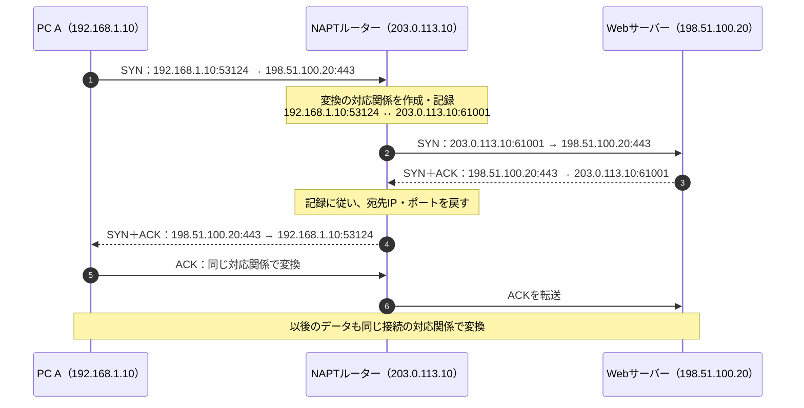

# 『おうちで学べるセキュリティの基本』2026-10-5 疑問15・16：NAT・NAPTと返答先の識別

## 疑問

> 15. NAT（アドレス変換って何？）
> - グローバルIPをローカルIPに変換するもの？
>
> 16. グローバルIPからローカルIPへデータを転送するのはルータの役目だと思うが、どのローカルIPに割り振るのか？識別方法は？MACアドレス？

## 回答

**NATは、中継するIPパケットのIPアドレスを、対応関係に従って書き換える仕組みです。** 家庭のIPv4通信では、行きの通信で「PCのプライベートIP → 外側で使うグローバルIP」、返答で「外側のグローバルIP → 元のPCのプライベートIP」と変換します。したがって、疑問15の理解は**返答の方向については合っていますが、行きの方向もあります**（[RFC 3022、2章・4.1節：NATの概要と変換対象](https://www.rfc-editor.org/rfc/rfc3022.html#section-2)）。

**複数のPCが一つのグローバルIPを共有する場合は、ポート番号も扱うNAPTが使われます。** 返答先は、ルーターが保持する**変換前後のIP・ポートの対応表**から特定します。外部サーバーから元のPCのMACアドレスが送られてくるわけではありません（[Cisco公式：NAT Overloadingと対応表の検索](https://www.cisco.com/c/en/us/td/docs/ios-xml/ios/ipaddr_nat/configuration/xe-2/nat-xe-2-book/iadnat-addr-consv.html)）。

この2つの疑問には、次の3つの技術が関係します。技術ごとに文書を分けています。

| 技術 | この疑問で担当すること | 解説 |
| --- | --- | --- |
| NAT・NAPT | 外側のIP・ポートを、元のPCのIP・ポートへ戻す | この文書 |
| IPルーティング | 宛先IPに届く経路・送信するインターフェースを選ぶ | [IPルーティング](./basic_security_at_home_20261005_question16_ip_routing.md) |
| ARP | 同じLANで次に渡す相手のIPv4アドレスからMACアドレスを調べる | [ARPとMACアドレス](./basic_security_at_home_20261005_question16_arp_mac_address.md) |

以下は**家庭用ルーターでIPv4のNAPTを使い、TCPで外部サーバーへ接続する例**です。図・表は仕様を基に作った説明用の例で、特定製品の設定や実測結果ではありません。

## 1. グローバルIPとプライベートIP

この文書では、質問の「ローカルIP」を、家庭のLANなどで使う**プライベートIPv4アドレス**という意味で扱います。

| 呼び方 | 意味 | この例での使い方 |
| --- | --- | --- |
| グローバルIP（パブリックIP） | インターネット上で配送に使えるアドレス | ルーターの外側のIP、外部サーバーのIP |
| プライベートIP | 組織・家庭などの内部で使うために予約されたアドレス | PC Aの `192.168.1.10`、PC Bの `192.168.1.11` |

プライベートIPv4の範囲は次の3つです。別々の家庭で同じアドレスを使えますが、**そのままインターネット全体の配送先には使えません**。一方、社内や家庭内では、プライベートIPを使ってルーティングできます（[RFC 1918、3章・5章：プライベートアドレスと経路情報](https://www.rfc-editor.org/rfc/rfc1918.html#section-3)）。

- `10.0.0.0` ～ `10.255.255.255`
- `172.16.0.0` ～ `172.31.255.255`
- `192.168.0.0` ～ `192.168.255.255`

なお、「ローカルIP」は文脈により意味が変わります。自分自身を指す `127.0.0.1` などのループバックアドレスと、ここで扱うプライベートIPは区別します。

## 2. NATとNAPTは何が違うか

| 用語 | 変換するもの | 対応関係の例 |
| --- | --- | --- |
| Basic NAT | IPアドレス | `192.168.1.10 ↔ 203.0.113.10`。同時に別のPCを接続するなら、別の外側IPへ対応付ける |
| NAPT（Network Address Port Translation） | IPアドレスと、TCP/UDPのポート番号など | `192.168.1.10:53124 ↔ 203.0.113.10:61001`。ポートなどで区別して、複数PCが外側IPを共有できる |

RFC 3022は両方をNATとして説明しています。そのため、家庭用ルーターの説明で単に「NAT」と書かれていても、ポートを扱うNAPTまで含むことがあります（[RFC 3022、概要・2章：Basic NATとNAPT](https://www.rfc-editor.org/rfc/rfc3022.html)）。

NAPTは、Ciscoなどでは **PAT（Port Address Translation）**、**NAT Overloading** とも呼ばれます（[Cisco公式：NAT FAQのPAT・Overloadingの説明](https://www.cisco.com/c/en/us/support/docs/ip/network-address-translation-nat/26704-nat-faq-00.html)）。

以下の `IP:ポート` は、例えば `192.168.1.10:53124` なら「IPアドレスが `192.168.1.10`、TCPポート番号が `53124`」という意味です。

## 3. 2台のPCが同じサーバーへ接続する例

```text
家庭のLAN                         家庭用ルーター                インターネット

PC A  192.168.1.10 ──┐          LAN側: 192.168.1.1
                    ├───────── [ NAPTを行う ] ───────── 外部Webサーバー
PC B  192.168.1.11 ──┘          WAN側: 203.0.113.10       198.51.100.20:443
```

LANは家庭内などのネットワーク、WANはこの図ではインターネットへ向かう側です。**ルーターは内側・外側で異なるIPアドレスを持ちます。** ここではWAN側にグローバルIPv4がある構成を想定します。

`203.0.113.10` と `198.51.100.20` は実際の接続先ではなく、グローバルIPの役割を示す**文書用アドレス**です（[RFC 5737：文書用IPv4アドレス](https://www.rfc-editor.org/rfc/rfc5737.html)）。

### 行き：PCの送信元IP・ポートを変換する

2台が、たまたま同じ送信元ポート `53124` を使ったとします。

| 通信 | ルーターへ届く前の送信元 | NAPT後の送信元 | 宛先 |
| --- | --- | --- | --- |
| PC Aから | `192.168.1.10:53124` | `203.0.113.10:61001` | `198.51.100.20:443` |
| PC Bから | `192.168.1.11:53124` | `203.0.113.10:61002` | `198.51.100.20:443` |

この例では、外側のポートを別々にすることで、同じ外側IPから同じサーバーへ向かう通信を区別しています。サーバーから見ると、接続元は同じIPでもポートが異なります。

- `53124`：PC側がその接続で使うポート。
- `443`：この例のWebサーバー側の受付ポート。
- `61001`・`61002`：ルーターが外側の通信に使うポートの例。

**NAPTで必ずポート番号が変わるわけではありません。** 元の番号を維持できる場合もあります。ここでは変換が見えるように別の番号を使っています（[RFC 4787、4.2.1節：ポートの維持と衝突](https://www.rfc-editor.org/rfc/rfc4787.html#section-4.2.1)）。

### 返答：対応表を使って、元のPCへ戻す

ルーターは、例えば次のような変換・接続の記録を保持します。表示形式は製品によって異なります。

| プロトコル | 内側のIP・ポート | 外側のIP・ポート | 通信相手のIP・ポート |
| --- | --- | --- | --- |
| TCP | `192.168.1.10:53124` | `203.0.113.10:61001` | `198.51.100.20:443` |
| TCP | `192.168.1.11:53124` | `203.0.113.10:61002` | `198.51.100.20:443` |

```text
Webサーバーからの返答

198.51.100.20:443 → 203.0.113.10:61001
                          │ ルーターが記録を照合
                          └→ 宛先を 192.168.1.10:53124 に戻す → PC A

198.51.100.20:443 → 203.0.113.10:61002
                          │ ルーターが記録を照合
                          └→ 宛先を 192.168.1.11:53124 に戻す → PC B
```

**返答が来てから空いているPCへ割り振るのではなく、行きの通信で記録した対応関係へ戻します。** また、NAPT後も最終的にPCへ渡す際には、元のPC側のポートへ戻すため、その接続を待っている処理へ届きます（[Cisco公式：NAT Overloadingの返答処理](https://www.cisco.com/c/en/us/td/docs/ios-xml/ios/ipaddr_nat/configuration/xe-2/nat-xe-2-book/iadnat-addr-consv.html)）。

MACアドレスを使うのは、ここで特定したPCへ**LAN内で配送する段階**です。詳しくは[ARPの文書](./basic_security_at_home_20261005_question16_arp_mac_address.md)で扱います。

## 4. 対応表は、いつ作り、何を記録するのか

次は、PC Aから始めるTCP通信の概念図です。NAPTによる変換を説明するため、MACアドレスとファイアウォールの判定は省いています。



この図は新しい対応関係を作る例です。実装や通信条件によって、既存の対応関係を再利用する場合もあります。TCPでは最初のSYNから変換が必要であり、**TCPの接続確立が終わってから記録し始めるわけではありません**（[RFC 5382、4.1～4.2節：TCPの変換記録](https://www.rfc-editor.org/rfc/rfc5382.html#section-4.1)）。

対応表については、次を押さえます。

- **プロトコルも関係する。** TCPの `61001` とUDPの `61001` は区別して扱えます。
- **一つのPCが複数の対応関係を持てる。** 別の接続を始めれば、その通信に合う記録が必要です。「PC Aは永久に61001番」と決まるわけではありません。
- **動的な記録は一時的。** 通信終了や一定時間の無通信などに応じて削除されます。製品の設定や通信状態によって寿命は異なります。

プロトコルの扱いは[RFC 7857、5章](https://www.rfc-editor.org/rfc/rfc7857.html#section-5)、TCPの時間切れは[RFC 5382、5章](https://www.rfc-editor.org/rfc/rfc5382.html#section-5)で説明されています。対応表は転送用の状態であり、過去の通信をずっと残すログとは目的が異なります。

**「ポート番号だけで、どんな通信でも識別できる」とは覚えません。** 基本となる情報は、プロトコル、送信元IP・ポート、宛先IP・ポートです。先ほどの例では外側の宛先ポートが違うので見分けやすいですが、通信相手が異なれば外側のポートを共有できる実装もあります（[RFC 7857、3章：5つの情報と外側ポートの共有](https://www.rfc-editor.org/rfc/rfc7857.html#section-3)）。

なお、ここでのポート番号の説明はTCP/UDPを対象にしています。ICMPの問い合わせなどにはTCP/UDPのポートがなく、別の識別子を変換する場合があります（[RFC 3022、2.2節：ICMP問い合わせの識別子](https://www.rfc-editor.org/rfc/rfc3022.html#section-2.2)）。

## 5. 外から新しく接続する場合は、どう決めるか

これまでの例は**内側から始めた通信への返答**です。外部の人が家庭のサーバーへ**新しい接続を始める場合**は、固定の転送設定などを使って、転送先を指定できます。代表例が**ポート転送（ポートフォワーディング）**です。

| 条件 | 転送先の例 |
| --- | --- |
| WAN側IP `203.0.113.10` のTCP `8443` 番へ届く | LAN内サーバー `192.168.1.50` のTCP `443` 番へ転送 |

```text
外部クライアント
      │ 宛先 203.0.113.10:8443
      ▼
家庭用ルーター
      │ 固定ルールにより宛先IP・ポートを変換
      ▼
LAN内サーバー 192.168.1.50:443
```

このように、外側のポートと内側のポートは同じでなくても構いません。設定の条件に合う接続は、指定した内側の宛先へ向かいます。宛先を書き換える変換は**DNAT（Destination NAT）**と呼ばれ、ポート転送はその利用例です（[Netfilter公式：nftablesのDNATとポートの指定](https://netfilter.org/projects/nftables/manpage.html)）。外から始める通信の静的な対応付けは[RFC 3022、2.2節](https://www.rfc-editor.org/rfc/rfc3022.html#section-2.2)で説明されています。

| 到着した通信 | 転送先を決める根拠 |
| --- | --- |
| 内側から始めた通信への返答 | その通信の動的な変換・接続記録 |
| ポート転送で公開したサービスへの新規接続 | あらかじめ設定したIP・ポートの転送ルール |
| 対応する記録も転送ルールもない通信 | この例のNAPTでは、内側の特定PCへの転送先が定まらない |

最後の行は「ルーター宛ての通信はすべて破棄される」という意味ではありません。ルーター自身が提供するサービス宛ての場合は、ルーターが受け取ることもあります。また、既存の変換記録を外部からの新規接続に使えるかは、受信の制御方針によって変わります（[RFC 5382、4.3節：外から開始する接続](https://www.rfc-editor.org/rfc/rfc5382.html#section-4.3)）。

## 6. NATとファイアウォールは、役割を分けて考える

| 機能 | 判断すること |
| --- | --- |
| NAT・NAPT | どのIP・ポートへ変換するか |
| ファイアウォール・フィルタリング | その通信を許可するか、拒否するか |

**転送先が分かることと、その通信を通してよいことは別です。** ポート転送の設定があっても、ルーターや受信端末のファイアウォール、サービス側の設定が通信を許可する必要があります。

動的な変換記録がない通信を内側へ届けにくいことには防御上の効果があります。しかし、**IPアドレスを書き換えること自体は、通信の暗号化やマルウェアの検査ではありません**。受信をどう制限するかを明示的に設計します（[RFC 4787、4.1節・5章：変換とフィルタリングの区別](https://www.rfc-editor.org/rfc/rfc4787.html#section-5)、[RFC 4864、2.2節：NATと保護の限界](https://datatracker.ietf.org/doc/html/rfc4864#section-2.2)）。

既存の[ステートフルインスペクションの解説](./basic_security_at_home_20261005_question7_stateful_inspection.md)も、接続記録を使います。例えばLinuxのnftablesでは、NATもconntrackという接続追跡の情報を利用します。それでも、「変換するための対応関係」と「許可・拒否の判断」は分けて理解します（[Netfilter公式：natチェーンとconntrack](https://netfilter.org/projects/nftables/manpage.html)）。

## 7. この説明を当てはめるときの補足

- **PCへプライベートIPを割り当てる処理は、NATではありません。** 自動割り当てにはDHCPなどを使い、手動設定もできます。NATは、すでにIPを持つPCの通信を中継するときに変換します（[RFC 2131、1章・2.2節：DHCPの役割](https://www.rfc-editor.org/rfc/rfc2131.html#section-1)）。
- **家庭用ルーターのWAN側に、必ずグローバルIPv4があるとは限りません。** ISP側でも変換するCGNATなどでは、家庭用ルーターより外側にもNATがあります。この場合、自宅だけでポート転送を設定しても、ISP側からの経路・変換が用意されなければ外から接続できません。CGNAT用の共有アドレス空間 `100.64.0.0/10` は、RFC 1918の3つの範囲とは別です（[RFC 6598、1～2章・7章：CGNATと共有アドレス空間](https://www.rfc-editor.org/rfc/rfc6598.html)）。
- **IPv6では、端末がグローバルアドレスを持ち、アドレス共有のNATを使わず通信できます。** その場合でも、外からの新規接続を制限するファイアウォールは使えます。「NATがないから外部へ無制限に公開される」とは限りません（[RFC 4864、概要・4.2節：NATなしでのIPv6の保護](https://datatracker.ietf.org/doc/html/rfc4864#section-4.2)）。

次に読む：[疑問16：IPルーティングと転送経路](./basic_security_at_home_20261005_question16_ip_routing.md)、[疑問16：ARPとMACアドレスによるLAN内の配送](./basic_security_at_home_20261005_question16_arp_mac_address.md)。

調査日：2026-10-07。根拠はIETF／RFC EditorのRFC、Cisco・Netfilterの公式資料です。文中の図・アドレス・対応表は理解のための構成例です。
