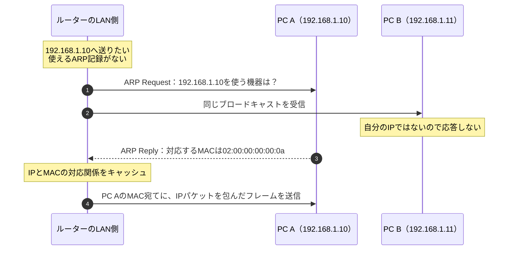

# 『おうちで学べるセキュリティの基本』2026-10-5 疑問16：ARPとMACアドレスによるLAN内の配送

## 疑問

> グローバルIPからローカルIPへデータを転送するのはルータの役目だと思うが、どのローカルIPに割り振るのか？識別方法は？MACアドレス？

## 回答

**MACアドレスは、特定した相手へLAN内で配送する段階で使います。** ただし、NAPTでグローバルIPを共有する複数PCのうち、返答先がどのPCかを特定する根拠は、**変換・接続の対応表**です。外部サーバーから元のPCのMACアドレスが渡されるわけではありません。

返答の宛先が `192.168.1.10` に戻った後、その宛先へ直接届けられるLAN上では、**ARP（Address Resolution Protocol）**により、そのIPv4アドレスに対応するMACアドレスを調べます。ARPの仕様も、ルーティングで次の配送先を決めた後、リンク上のアドレスを調べる流れを説明しています（[RFC 826：Packet Generation](https://www.rfc-editor.org/rfc/rfc826.html)）。

ここでは、IPv4をEthernetのLAN上で送る例を使います。NAPTの詳細は[NAT・NAPTの文書](./basic_security_at_home_20261005_question15_16_nat_napt.md)、経路選択は[IPルーティングの文書](./basic_security_at_home_20261005_question16_ip_routing.md)を参照してください。

## 1. IP、ポート、MACは、見る範囲が違う

| 情報 | 主な役割 | 返答がPC Aへ向かう例 |
| --- | --- | --- |
| IPアドレス | ネットワークをまたいで宛先へ向かうためのアドレス | 宛先IPは、NAPTで `192.168.1.10` に戻す |
| TCP/UDPのポート番号 | 端末上の通信の受け口を区別する情報 | 宛先TCPポートは、元の `53124` に戻す |
| MACアドレス | 同じリンク上でフレームを渡す相手のアドレス | LAN上でPC Aに届けるために、PC AのMACを使う |

**フレーム**は、Ethernetなどのリンクでデータを届けるための包みです。IPパケットを、そのリンクで使うフレームに包んで送ります。TCP/UDPのデータは、さらにIPパケットの中に入っています。

```text
Ethernetフレーム
┌─────────────────────────────────────────────┐
│ Ethernetヘッダー：送信元MAC、宛先MAC          │
│ ┌─────────────────────────────────────────┐ │
│ │ IPヘッダー：送信元IP、宛先IP              │ │
│ │ ┌─────────────────────────────────────┐ │ │
│ │ │ TCPヘッダー：送信元・宛先ポート       │ │ │
│ │ │ データ                              │ │ │
│ │ └─────────────────────────────────────┘ │ │
│ └─────────────────────────────────────────┘ │
└─────────────────────────────────────────────┘
```

これは主要な情報だけを示した図です。**宛先IPと宛先MACは別のヘッダーにあり、同じ機器を指すとは限りません。** 遠くのサーバー宛てなら、IPはサーバー、MACは次に渡すルーター、という組み合わせになります。ルーターは転送時、次のリンクに合うフレームへ包み直します（[RFC 1812、5.2.1.2節の手順10～11：リンク層のアドレスとフレーム](https://www.rfc-editor.org/rfc/rfc1812.html#section-5.2.1.2)）。

## 2. ARPで、IPからMACを調べる

NATの文書と同じく、PC AのIPv4アドレスを `192.168.1.10`、ルーターのLAN側を `192.168.1.1` とします。MACアドレスは説明用です。

| 機器 | IPv4アドレス | MACアドレス |
| --- | --- | --- |
| 家庭用ルーターのLAN側 | `192.168.1.1` | `02:00:00:00:01:01` |
| PC A | `192.168.1.10` | `02:00:00:00:00:0a` |
| PC B | `192.168.1.11` | `02:00:00:00:00:0b` |

ルーターは、例えば次の**ARPキャッシュ（ARP表）**を保持します。これは、最近得たIPとMACの対応関係です。

| LAN側のIPv4アドレス | 対応するMACアドレス |
| --- | --- |
| `192.168.1.10` | `02:00:00:00:00:0a` |
| `192.168.1.11` | `02:00:00:00:00:0b` |

使える記録があればそれを利用します。記録がなければ、次のように問い合わせます。



最初の2本の矢印は、**一つのブロードキャストが同じLANの複数機器へ届くこと**を示しています。PC A・Bへ別々に問い合わせを作る意味ではありません。EthernetのARP Requestは通常ブロードキャストされ、対象のIPを使う機器がReplyを返します（[RFC 826：Packet Generation・Packet Reception](https://www.rfc-editor.org/rfc/rfc826.html)）。

この例ではARPへの返答を受けて送信します。ARP表に対応があれば、毎回問い合わせる必要はありません。

## 3. NAPTの対応表とARP表は別の情報

同じルーターが両方を持つため、混同しやすい部分です。

| 表 | 対応付けるもの | この例の1項目 | 分かること |
| --- | --- | --- | --- |
| NAPTの変換・接続記録 | 内側と外側のIP・ポートなど | TCP `192.168.1.10:53124 ↔ 203.0.113.10:61001` | この通信の返答をどのIP・ポートへ戻すか |
| ARP表 | 同じリンク上のIPv4アドレスとMAC | `192.168.1.10 → 02:00:00:00:00:0a` | 次に渡す相手のMACは何か |

根拠：[RFC 3022、3.1～3.2節：NAPTの対応関係](https://www.rfc-editor.org/rfc/rfc3022.html#section-3.1)、[RFC 826：ARPの対応表](https://www.rfc-editor.org/rfc/rfc826.html)。

**ARP表だけでは、外側IPの61001番への返答がPC Aの53124番に対応することは分かりません。** 逆に、NAPTの記録から宛先IPが分かっても、そのリンクへ送るにはMACなどのリンク層の情報が必要です。

PC Aから複数のTCP接続を作れば、NAPT側には複数の接続の記録ができます。一方、同じLAN上の同じPC Aに届けるための `IP → MAC` の対応は、複数の接続で共有できます。

## 4. PCのMACは、遠くのサーバーまで引き継がれない

行きの通信で、PC AからWebサーバーへ送る場合を見ます。

| 区間 | IPの送信元 → 宛先 | その区間のMACの送信元 → 宛先 |
| --- | --- | --- |
| PC A → 家庭用ルーター | `192.168.1.10 → 198.51.100.20` | PC AのMAC → 家庭用ルーターのLAN側MAC |
| 家庭用ルーター → ISP側の次のルーター | NAPT後の `203.0.113.10 → 198.51.100.20` | このWANもEthernetなら、家庭用ルーターのWAN側MAC → 次のルーターのMAC |

このように、**ルーターをまたぐと、Ethernetのフレームは次のリンクに合わせて作られます。** PC AのMACを、遠くのサーバーまでの転送先の識別に使い続けるわけではありません。なお、インターネット上の全リンクがEthernetとは限らず、MACを使わない接続方式もあります（[RFC 1812、3.2節・5.2.1.2節：リンクによる違いと包み直し](https://www.rfc-editor.org/rfc/rfc1812.html#section-3.2)）。

したがって、PC Aは外部サーバーのMACをARPで調べません。外部サーバーへの通信では、同じLAN上にある**次ホップのルーター**のMACを調べます。ARPの問い合わせが、ルーターを越えてインターネット中に届くこともありません。

返答の最後の区間では、ルーターがLAN側のフレームを作ります。

```text
ルーター → PC A

Ethernetの送信元MAC：ルーターのLAN側MAC
Ethernetの宛先MAC  ：PC AのMAC

IPの送信元        ：外部サーバーのIP 198.51.100.20
IPの宛先          ：NAPTで戻したPC AのIP 192.168.1.10
TCPの宛先ポート   ：NAPTで戻した53124
```

**IPの送信元は外部サーバーでも、直前のLAN区間での送信元MACはルーターです。** ここが、IPとMACの役割の違いをつかむポイントです。

## 5. 手元でARP表を確認する

次のコマンドは、保存された対応関係を表示します。

| OS | 表示コマンド |
| --- | --- |
| macOS | `arp -an` |
| Windows | `arp -a` |
| Linux（iproute2） | `ip -4 neigh show` |

macOSのオプションは、この環境の `man 8 arp` で確認しています。Windowsは[Microsoft公式：arp](https://learn.microsoft.com/en-us/windows-server/administration/windows-commands/arp)、Linuxは[ip-neighbourのマニュアル](https://man7.org/linux/man-pages/man8/ip-neighbour.8.html)を参照してください。

表示例は次のようなものです。形式やインターフェース名はOS・端末で異なります。

```text
192.168.1.1  →  02:00:00:00:01:01
```

PCで実行した場合に見えるのは、**そのPC自身が持つ表**です。家庭用ルーターのNAPT対応表を表示するコマンドではありません。また、最近やり取りしていない相手は表にないこともあるため、**LAN内の全機器一覧とは限りません**。

IPv6ではARPを使わず、**Neighbor Discovery（近隣探索、ND）**が同じリンク上のリンク層アドレスを調べる役割などを担います（[RFC 4861、概要・7.2節：IPv6のアドレス解決](https://www.rfc-editor.org/rfc/rfc4861.html#section-7.2)）。

関連：[NAT・NAPTと返答先の識別](./basic_security_at_home_20261005_question15_16_nat_napt.md)、[IPルーティングと転送経路](./basic_security_at_home_20261005_question16_ip_routing.md)。

調査日：2026-10-07。根拠はIETF／RFC EditorのRFC、Microsoft公式資料、OS・iproute2のマニュアルです。図・表・表示例は説明用です。
