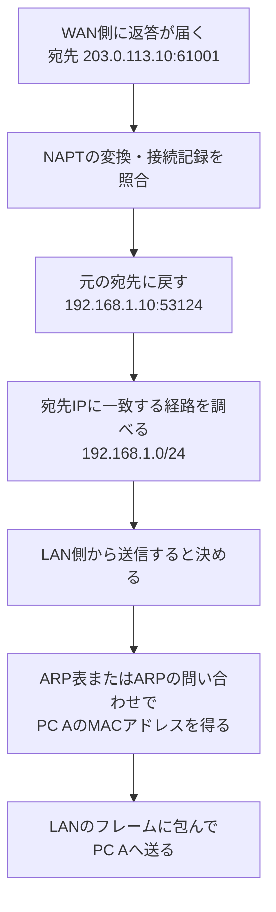

# 『おうちで学べるセキュリティの基本』2026-10-5 疑問16：IPルーティングと転送経路

## 疑問

> グローバルIPからローカルIPへデータを転送するのはルータの役目だと思うが、どのローカルIPに割り振るのか？識別方法は？MACアドレス？

## 回答

**ネットワークをまたいでIPパケットを中継するのは、ルーターの役目です。** ただし、**元のPCのIP・ポートを復元するNAPT**と、**宛先IPへ向かう経路を選ぶルーティング**は別の機能です。

家庭のNAPTを通る返答なら、まず変換記録から宛先を元のPCへ戻し、そのIPへ届く経路を使って転送します。普通のIPルーティングでは、宛先IPと経路表を基に送信先の経路を選びます（[RFC 1812、5.2.1.2節・5.2.4節：ルーターの転送と次の中継先](https://www.rfc-editor.org/rfc/rfc1812.html#section-5.2.1.2)）。

NAPTの対応表は[疑問15・16：NAT・NAPT](./basic_security_at_home_20261005_question15_16_nat_napt.md)、MACアドレスへの対応付けは[疑問16：ARP](./basic_security_at_home_20261005_question16_arp_mac_address.md)を参照してください。ここでは、**「どちらのネットワークへ送るか」**を説明します。

## 1. 経路表は「その宛先なら、どこへ送るか」を示す

**ルーティングテーブル（経路表）**は、宛先となるIPの範囲と、そこへ送るための経路を記録した表です。送信するネットワーク接続口を**インターフェース**、次にパケットを渡す機器を**次ホップ**と呼びます。

NATの文書と同じ家庭の例を使います。WAN側もEthernetで接続し、ISP側の次のルーターを `203.0.113.1` とする説明用の構成です。

```text
PC A                  家庭用ルーター                  ISP側ルーター       外部サーバー
192.168.1.10  ──LAN──  LAN側: 192.168.1.1/24
                      WAN側: 203.0.113.10/24  ──WAN──  203.0.113.1  ──…── 198.51.100.20
```

グローバルIP役の `203.0.113.x`・`198.51.100.x` は文書用アドレスです（[RFC 5737](https://www.rfc-editor.org/rfc/rfc5737.html)）。実際のWAN接続方式や経路表は契約・機器で異なります。

ルーターの経路表を、必要な部分だけ単純化すると次のようになります。

| 宛先の範囲 | 次ホップ | 送信するインターフェース | 意味 |
| --- | --- | --- | --- |
| `192.168.1.0/24` | そのLAN上の宛先 | LAN側 | 家庭内の宛先へ直接渡せる |
| `203.0.113.0/24` | そのWAN上の宛先 | WAN側 | WAN側の同じネットワーク上にある |
| `0.0.0.0/0` | `203.0.113.1` | WAN側 | ほかの、より具体的な経路に当てはまらない宛先はISP側へ渡す |

`/24` は、IPv4の32ビットのうち先頭24ビットをネットワークの範囲を示す部分として使う、という表記です。この例の `192.168.1.0/24` は `192.168.1.0` ～ `192.168.1.255` の範囲を表します。通常の端末に使うのは、このうちネットワークアドレス・ブロードキャストアドレスを除く範囲です。

`0.0.0.0/0` は全IPv4アドレスに一致する、**デフォルトルート**です。複数の経路が一致した場合、通常は**より長いプレフィックス、つまり宛先の範囲がより具体的な経路**を選びます。例えば、`192.168.1.10` には `/24` と `/0` の両方が一致しますが、`/24` を優先します（[RFC 1812、2.2.5.2節・5.2.4.3節：ネットワークプレフィックスと最長一致](https://www.rfc-editor.org/rfc/rfc1812.html#section-5.2.4.3)）。

## 2. 返答がPC Aへ届くまで

外部サーバーからの返答が次の宛先で家庭用ルーターへ来たとします。

```text
送信元：198.51.100.20:443
宛先  ：203.0.113.10:61001
```

ここから、役割を次のように分けます。



この図は、**受信が許可された通信について、各機能が何を決めるか**を示す概念図です。ファイアウォールの判定などは省略しており、全製品の内部処理順序を定めるものではありません。

| 段階 | 決めること | この例で得られる結果 |
| --- | --- | --- |
| NAPT | 変換された宛先を、どの元のIP・ポートへ戻すか | `192.168.1.10:53124` |
| ルーティング | そのIPへ届く経路・インターフェースはどれか | LAN側から直接届ける |
| ARP | 同じLAN上の、そのIPのMACは何か | PC AのMACアドレス |

**PC AをPC Bへ変える選択は、普通のルーティングでは行いません。** この例ではNAPTで宛先がPC Aに戻ったので、そのIPへ向かう経路を選びます。LAN内サーバーを選び分ける負荷分散などは、別の仕組みとして考えます。

## 3. 行きの通信では「最終宛先」と「次ホップ」が違う

PC Aが外部サーバーへ送る際、最終的な宛先IPは `198.51.100.20` です。しかし、PC Aは外部サーバーと同じLANにいません。PC側の経路表で適切な経路を選び、この例では**デフォルトゲートウェイ `192.168.1.1`** へ渡します。

デフォルトゲートウェイは、ほかの具体的な経路がないときに使う、次のルーターです。**PCがIPパケットの宛先を「ゲートウェイのIP」に置き換えるわけではありません。** 宛先IPは外部サーバーのまま、LANの配送先をゲートウェイにします（[RFC 1122、3.3.1.1～3.3.1.2節：直接配送とゲートウェイの選択](https://www.rfc-editor.org/rfc/rfc1122.html#section-3.3.1.1)）。

| 送信する機器 | 最終宛先IP | 次ホップのIP | LANなどで調べるMAC |
| --- | --- | --- | --- |
| PC A | `198.51.100.20` | 家庭用ルーター `192.168.1.1` | 家庭用ルーターのLAN側MAC |
| 家庭用ルーター | `198.51.100.20` | ISP側ルーター `203.0.113.1` | このEthernetの例では、ISP側ルーターのMAC |

ルーターは、それぞれの経路表を使って**次にどこへ渡すか**を決めます。家庭用ルーターが、遠くのWebサーバーまでの全ルーターのMACアドレスを把握する必要はありません。

## 4. NATがなくても、ルーターは転送できる

**「ルーターで中継すること」と「IPアドレスを変換すること」は別です。** 例えば社内の2つのネットワークなら、次のようにプライベートIP同士をNATなしで中継できます。

```text
PC X                         社内ルーター                     PC Y
192.168.10.10  ───────────── [2つのLANを中継] ───────────── 192.168.20.20

IPの送信元：192.168.10.10
IPの宛先  ：192.168.20.20
```

この場合、両方向の経路と必要な許可設定があれば、IPの送信元・宛先を書き換えずに届けられます。**普通の転送でもTTLなどのヘッダー項目は変わります**が、IPアドレスの変換は必須ではありません（[RFC 1918、3章・5章：内部でのプライベートIPの利用](https://www.rfc-editor.org/rfc/rfc1918.html#section-5)、[RFC 1812、5.2.1.2節：通常の転送処理](https://www.rfc-editor.org/rfc/rfc1812.html#section-5.2.1.2)）。

また、同じLAN・同じサブネット上のPC同士なら、PC自身が相手を直接の配送先にできます。家庭用ルーターに内蔵されたスイッチやアクセスポイントを通る場合も、**別のネットワークへルーティングする処理を使うとは限りません**（[RFC 1122、3.3.1.1節：同じネットワークへの配送](https://www.rfc-editor.org/rfc/rfc1122.html#section-3.3.1.1)）。

関連：[NAT・NAPTと返答先の識別](./basic_security_at_home_20261005_question15_16_nat_napt.md)、[ARPとMACアドレスによるLAN内の配送](./basic_security_at_home_20261005_question16_arp_mac_address.md)。

調査日：2026-10-07。根拠はIETF／RFC EditorのRFCです。図・経路表は説明用に単純化した構成例です。
