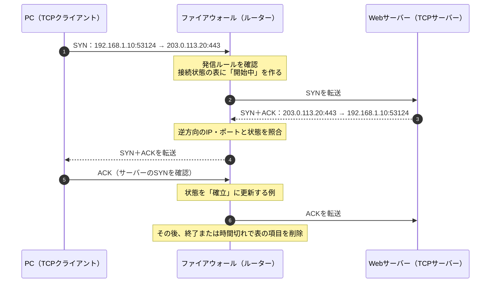
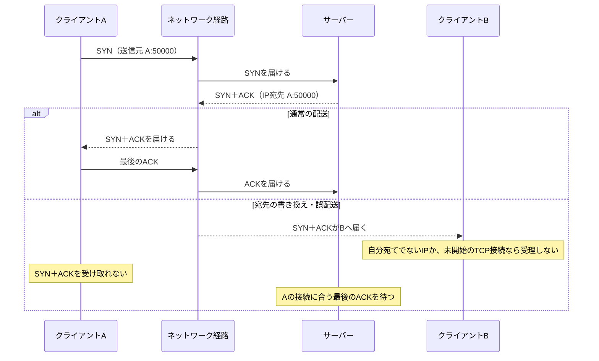

# 『おうちで学べるセキュリティの基本』2026-10-5 疑問7：ステートフルインスペクションと偽装した通信

## 疑問

> ステートフルインスペクションは偽装した通信を遮断するとあるが、偽装した通信とは例えばどのようなものか？

## 回答

**代表例は、実際には開始していない通信について「既存の通信への返答です」と装うパケットです。** ステートフルインスペクションを行うファイアウォールは、許可した通信の開始・継続・終了を記録し、後から届いたパケットがその通信に対応するかを調べます。送信元IPアドレスとTCPの `ACK` フラグを見るだけで「正しい返答」と判断するわけではありません。NISTは、通信の一部に見せかけたパケットについて、ファイアウォールが接続記録を照合する例を挙げています（[NIST SP 800-41 Rev.1、2.1.2節](https://nvlpubs.nist.gov/nistpubs/Legacy/SP/nistspecialpublication800-41r1.pdf)）。

### 通信の記録を使った判定

以下は、NATによるアドレス変換を省いた概念図です。IPアドレスは説明用の例です。

```text
家のPC                       ファイアウォール                    Webサーバー
192.168.1.10:53124                 │                       203.0.113.20:443
      │── 接続開始（SYN）───────────→│──────────────→│
      │                   許可ルールを確認し、通信を記録       │
      │←─────────────── 対応する返答（SYN, ACK）──────────────│
      │                   記録に合うので通す                 │

別の送信元（198.51.100.77:443）
          ──「返答」を装ったACK ──→│ 記録に合わないので遮断
```

ファイアウォールの記録には、通常、送信元・宛先のIPアドレス、ポート番号、通信の状態が含まれます。TCPでは `SYN → SYN, ACK → ACK` という接続開始の流れなどを追い、製品によってはシーケンス番号なども確認します。`ACK` はTCPの確認応答を示すフラグですが、**そのビットが立っていること自体は、過去に通信した証拠ではありません**（[NIST SP 800-41 Rev.1、2.1.2節](https://nvlpubs.nist.gov/nistpubs/Legacy/SP/nistspecialpublication800-41r1.pdf)、[RFC 9293：TCPの状態とACKの扱い](https://www.rfc-editor.org/rfc/rfc9293.html)）。

| 届いたパケットの例 | 接続記録との関係 | 基本的な判断 |
| --- | --- | --- |
| PCが開始した接続に対応する、Webサーバーからの返答 | IP・ポートとTCPの状態が合う | 許可する |
| PCが何も開始していないのに届く「返答」の `ACK` | 対応する記録がない | 遮断する |
| 返答元のIPをWebサーバーに偽装したが、ポートや状態が合わないパケット | 記録と一致しない | 遮断する |

最後の2行が、質問にある「偽装した通信」の具体例です。攻撃者は `ACK` を立てたり、送信元IPアドレスを書き換えたりできますが、ファイアウォールが**以前に通した通信の記録**とも照合すれば、単なる見た目の偽装は通りにくくなります。ただし、記録との照合方法や厳密さは製品・設定によって異なります（[NIST SP 800-41 Rev.1、2.1.2節](https://nvlpubs.nist.gov/nistpubs/Legacy/SP/nistspecialpublication800-41r1.pdf)）。

### 「IPアドレスを偽れない」という意味ではない

ここでいう偽装には、次のように異なる問題があります。

1. **通信の状態の偽装：** 未開始の通信を、すでに確立した通信の一部に見せる。接続記録との照合が主な対策です。
2. **送信元IPアドレスの偽装（IPスプーフィング）：** IPヘッダーに別の送信元アドレスを書く。外側の回線から届いたパケットが内側のアドレスを名乗っていないか、などを調べる**送信元アドレスのフィルタリング**も対策です。これは接続状態の確認とは別の仕組みです（[RFC 3704：Ingress Filtering](https://www.rfc-editor.org/rfc/rfc3704.html)）。

ステートフルインスペクションは、送信元の身元を暗号学的に証明する機能ではありません。攻撃者が既存の通信に見える情報を十分に合わせた場合や、通信経路上で内容を見られる場合など、これだけで全ての偽装を防ぐとはいえません。また、**正規の手順で新たに開始された悪意ある通信**は、許可ルールに合えば通ります。RFC 5961も、TCPに対する偽装パケット対策は攻撃を難しくするもので、完全な認証の代わりにはならないと説明しています（[RFC 5961、10節](https://www.rfc-editor.org/rfc/rfc5961.html)）。

UDPにはTCPのような接続開始の手順がありません。UDPを扱うステートフルファイアウォールは、送信元・宛先のIPアドレスとポート、時間切れなどから「問い合わせに対応する返答か」を判断します。例えば、PCからDNS問い合わせを送った記録があるときだけ、対応するDNS応答を通すという形です（[NIST SP 800-41 Rev.1、2.1.2節](https://nvlpubs.nist.gov/nistpubs/Legacy/SP/nistspecialpublication800-41r1.pdf)）。

**覚え方：** `ACK` や送信元IPという「パケットの自己申告」だけで信じず、**許可した通信の履歴と照合する**のがステートフルインスペクションです。IPアドレスの不自然さを調べるフィルタリングと併用して防御します。

## 追加質問1：SYNとACKの何を、どこに記録するのか？

> 通信の記録を使った判定とは、SYNとACKの状態を見ているということ？ 何をどこで記録するのか、流れを知りたい。

**TCPのSYN・ACKなどを見て接続の進行を判断する、という理解でおおむね合っています。** ただし、ファイアウォールが単に「SYNを見た」「ACKを見た」という印を付けるだけではありません。許可した通信ごとに、**誰から誰へ、どのポートで始まり、いまどの段階か**を対応付けます。製品によってはTCPのシーケンス番号も検査します（[NIST SP 800-41 Rev.1、2.1.2節](https://nvlpubs.nist.gov/nistpubs/Legacy/SP/nistspecialpublication800-41r1.pdf)）。

次の図では、PCがWebサーバーへ接続します。**この例のルーター上のファイアウォールはSYN＋ACKを生成せず、中継しながら判断します。** 分かりやすさのため、NATによるアドレス変換は省いています。



| 図の段階 | ファイアウォールが保持する情報の例 | 次のパケットの判定にどう使うか |
| --- | --- | --- |
| PCからのSYNを許可した後 | `TCP / 192.168.1.10:53124 → 203.0.113.20:443 / 開始中` | この通信に対応する逆向きのSYN＋ACKを待つ |
| サーバーからSYN＋ACKが届いた後 | 同じ通信のIP・ポートと、進んだ接続状態 | 無関係なIP・ポートからの「返答」を除外する |
| PCから最後のACKが届いた後 | 同じ通信の状態を「確立」に更新する例 | 続くデータがこの通信に属するかを調べる |

この情報は、**通信経路にあるファイアウォール自身の接続状態の表**に置かれます。家庭用ルーターならルーター内のメモリ、PCのOSのファイアウォールならそのPCのメモリで管理する一時的な情報です。パケット全部を保存する通信ログとは別のものです。Linuxの接続追跡機能にも、現在の接続項目数、TCPの状態、状態ごとの時間切れが定義されています。また、**PCとWebサーバー自身も**、ファイアウォールの表とは別にTCP接続の状態を持ちます（[Linux Kernel：conntrackの項目数・時間切れ](https://docs.kernel.org/networking/nf_conntrack-sysctl.html)、[Linux Kernel：conntrackのTCP状態](https://docs.kernel.org/netlink/specs/conntrack.html)、[RFC 9293：TCB](https://www.rfc-editor.org/rfc/rfc9293.html)）。

**注意：** 上図の「最後のACKで確立」は典型的な説明です。NISTは、ファイアウォール製品によって接続状態の扱いが異なり、完全に確立する前のパケットを通す実装もあるとしています。**ファイアウォールの「確立」表示と、両端末のTCP状態を同一視しない**ことが大切です（[NIST SP 800-41 Rev.1、2.1.2節](https://nvlpubs.nist.gov/nistpubs/Legacy/SP/nistspecialpublication800-41r1.pdf)）。

## 追加質問2（補足）：AがSYNを送った後、SYN＋ACKがBに届くことはあるか？

> 1. AがサーバーへSYNを送ったのに、サーバーからのSYN＋ACKを受け取る相手がBに変わることはあるか？
> 2. その場合、3ウェイハンドシェイクだけで接続が確立するか。ファイアウォールで遮断できるか？
> 3. TLSで防げるか？

前回の回答は**最初のSYNの送信元IPが偽られた場合**を中心に説明していました。ここでは、ご質問どおり**AがSYNを送った後、返答だけがBへ届く場合**を扱います。

### 1. 通常はAへ返す。Bへ届くなら何かが変わっている

サーバーは、受け取ったSYNの**送信元IPアドレスと送信元ポート**を返答先にします。例えば、Aの `192.0.2.10:50000` からサーバーの `203.0.113.20:443` へSYNが届いたなら、通常のSYN＋ACKの宛先は `192.0.2.10:50000` です。TCPの接続は両端のIPアドレスとポートの組で区別されます（[RFC 9293、3.1節・3.5節](https://www.rfc-editor.org/rfc/rfc9293.html)）。



| Bに届く状況 | パケットの宛先IP・ポート | Bの通常の処理 |
| --- | --- | --- |
| 通信途中で、宛先IP・ポートがB向けに書き換えられた | B向けになっている | Bがその接続を開始していなければ、対応するTCP接続がなく、SYN＋ACKを受け入れない。RST（リセット）を返す場合がある |
| IPの宛先はAのまま、誤った機器や不正な経路によって物理的にBへ運ばれた | **A向けのまま** | BのIP層が「自分宛てではない」と判断し、通常はTCPへ渡さず破棄する |
| NAT機器が間にあり、サーバーにはNAT機器の公開IPが見える | サーバーからはNAT機器宛て | NAT機器が接続ごとの変換記録に従ってAへ戻す。Bへ戻るなら変換設定・記録の異常や改ざんなどを調べる |

したがって、**正しく届いたSYNに対してサーバーが理由なくAをBに選び直すことは、通常のTCP動作ではありません。** Bへ届くには、宛先の書き換え、転送経路の異常や攻撃、またはNATなどの中継機器の動作が関係します。なお、前回扱った「SYNの送信元を最初からBと偽る」場合は、サーバーから見ると**最初からBが接続を始めたように見える**別のケースです（[RFC 9293、3.5節](https://www.rfc-editor.org/rfc/rfc9293.html)、[RFC 1122、3.2.1.3節：自分宛てでないIPパケットの破棄](https://www.rfc-editor.org/rfc/rfc1122.html)、[RFC 5382、4.2節：NATの変換記録](https://www.rfc-editor.org/rfc/rfc5382.html)）。

### 2. AとBが別の端末なら、通常は握手を完了できない

**AがSYN＋ACKを受け取れず、BもそのTCP接続を開始していなければ、通常の3ウェイハンドシェイクは完了しません。** Aは返答を待ち、Bは対応する接続がないため受け入れません。サーバーも、接続に合う最後のACKを受け取らないまま待機・再送し、やがて時間切れになります。仮にBが自分のIPアドレスでACKを返しても、サーバーが待つAとの接続のIP・ポートの組に一致しません（[RFC 9293、3.5節・3.5.2節](https://www.rfc-editor.org/rfc/rfc9293.html)）。

ただし、**攻撃者Bが送るACKの送信元IPをAに偽装し、A宛てのSYN＋ACKを読み取れ、その後の通信も受け取れる場合**は別です。BがAになりすまして正しいIP・ポート・TCP番号で最後のACKを送れば、サーバー側は接続が成立したと判断し得ます。TCPの握手は利用者の身元を暗号学的に確認する仕組みではありません。サーバー側が接続成立と判断しても、A自身が通信できているとは限りません（[RFC 9293、3.5節](https://www.rfc-editor.org/rfc/rfc9293.html)、[RFC 5961、10節：TCP偽装対策の限界](https://www.rfc-editor.org/rfc/rfc5961.html)）。

#### 「AのIPを使う」の正確な意味

**はい。送信するIPパケットの「送信元IPアドレス」にAのアドレスを書くのは、IPスプーフィングです。** IPヘッダーの送信元アドレスには、パスワードや署名のような本人確認情報は含まれません。パケットを自由に生成できる権限や環境なら、BはAのアドレスを記したパケットを送れます。ただし、OSによる権限制限や、ネットワーク側の送信元アドレス検証で拒否される場合があります（[RFC 3552、3.3節](https://www.rfc-editor.org/rfc/rfc3552.html)、[Linux `raw(7)`：rawソケットの権限](https://man7.org/linux/man-pages/man7/raw.7.html)、[RFC 3704：送信元アドレス検証](https://www.rfc-editor.org/rfc/rfc3704.html)）。

送信元アドレスの検証が**ネットワークの範囲単位**なら、同じLAN内のAとBは区別できない場合があります。外との境界での検証だけで、LAN内のBによるなりすましを防げるとは限りません（[RFC 3552、3.3節](https://www.rfc-editor.org/rfc/rfc3552.html)、[RFC 3704、2.1節](https://www.rfc-editor.org/rfc/rfc3704.html)）。

| Bができること | 実際に起こること | AとのTCP通信をBが引き継げるか |
| --- | --- | --- |
| **送るときだけAのIPを名乗る**（IPスプーフィング） | サーバーからのSYN＋ACKや後続の返答は、通常どおり**AのIPへ**送られる | **それだけでは通常難しい。** Bは返答を見られず、サーバーのSYN＋ACKに含まれるTCP番号を直接確認できない |
| **A宛ての返答をBへ運ばせる・読み取る**（経路への介入） | 例えば同じLANでARPの対応関係を偽り、A宛ての通信をBの機器へ運ばせることがある | Bは返答を観測できる。ただし、Bの通常のIP/TCP処理が自動的にAの接続を受け入れるわけではない |
| **両方を行い、以後の往復も扱う** | BがAとして送信し、A宛ての返答も観測・転送できる | 正しいIP・ポート・TCP番号をそろえられれば、サーバーがBの偽装したACKをAからのACKと判断し得る |

このように**「AのIPを名乗って送る」と「A宛ての返答を受け取る」は別の能力**です。RFC 3552も、偽装パケットを送れても返答を受け取れない攻撃者を区別しています。ARPの対応関係を偽って同じLAN内の通信経路へ割り込む方法は**ARPスプーフィング**であり、IPヘッダーの送信元を書き換えるIPスプーフィングとは別です。ARPへの介入だけでBの通常のTCP接続が自動的にAの接続になるわけでもありません。なお、返答を見られない攻撃者による番号の推測攻撃も研究されているため、「通常難しい」は「絶対に不可能」という意味ではありません（[RFC 3552、3.3節・4.6.3.2節](https://www.rfc-editor.org/rfc/rfc3552.html)、[Cisco：ARPスプーフィングによる経路への介入](https://www.cisco.com/c/en/us/td/docs/switches/lan/catalyst9500/software/release/17-10/configuration_guide/sec/b_1710_sec_9500_cg/m9_1710_sec_dynamic_arp_cg.html)、[RFC 5961：経路外からのTCP偽装](https://www.rfc-editor.org/rfc/rfc5961.html)）。

| 対策 | このケースでできること | 限界 |
| --- | --- | --- |
| A・B自身のIP/TCP処理 | 自分宛てでないIPパケットや、対応する接続のないSYN＋ACKを受け入れない | BがAのIPや経路を支配した場合は、Aとの違いを判別しにくい |
| ステートフルファイアウォール | AのSYNを記録した同じファイアウォールが**B宛てに変わったSYN＋ACK**を見れば、記録と合わず遮断できる場合がある | 宛先IPがAのままで配送先の機器だけBになった場合、ファイアウォールの接続表だけでは配送先の異常を見抜けない。BがAの通信情報を正確に再現できる場合も本人確認にはならない |
| 送信元アドレス検証など | Bが別の場所からAのIPを名乗るパケットを止められる場合がある | 設置場所・ネットワーク構成に依存し、全てのなりすましを防げるわけではない |

ファイアウォールの接続表には通常、送信元・宛先IPとポート、通信状態が入ります。送信元アドレス検証は別の仕組みです。どちらも万能な本人確認ではありません（[NIST SP 800-41 Rev.1、2.1.2節](https://nvlpubs.nist.gov/nistpubs/Legacy/SP/nistspecialpublication800-41r1.pdf)、[RFC 3704：送信元アドレス検証](https://www.rfc-editor.org/rfc/rfc3704.html)）。

### 3. TLSはTCPの配送先を直さないが、接続後のなりすましを防ぐ手段になる

**ここで想定するTCP上のHTTPSでは、TLSはTCP接続の後に行う通信の認証・保護です。** SYN＋ACKをAではなくBへ届けないようにする仕組みではなく、TCPの握手そのものを成立させたり遮断したりもしません。AがSYN＋ACKを受け取れずTCP接続が成立しなければ、そもそもTLSのやり取りも始まりません（[RFC 8446、2章・4章](https://www.rfc-editor.org/rfc/rfc8446.html)）。

BがTCP接続を成立させられた場合に、TLSで何を防げるかは**どちらの身元を確認する設定か**で変わります。

| TLS・アプリの設定 | BがAになりすまして接続した場合 |
| --- | --- |
| 通常のHTTPSでサーバー証明書だけを検証 | Bはサーバーの正当性を確認できるが、**サーバーは接続者がA本人か確認できない**。これだけではクライアントのなりすましを防げない |
| A固有のクライアント証明書と秘密鍵を要求する相互TLS（mTLS） | BがAの秘密鍵を持たなければ、サーバーはTLSの認証段階でBを拒否できる |
| アプリケーションのログイン認証 | BがAの有効な認証情報を持たなければ、サービスの利用を拒否できる |

TLS 1.3はサーバー認証と、要求した場合のクライアント証明書による認証を定義しています。また、AとサーバーのTLS通信が既に成立しているなら、鍵を持たないBはAのTLSメッセージを正しく偽造できません。ただし、**TLSはパケットの誤配送や通信妨害を防ぐ仕組みではなく、BがAの秘密鍵・ログイン情報まで奪っている場合にも別途対処が必要**です（[RFC 8446、2章・4.4.2節・5章](https://www.rfc-editor.org/rfc/rfc8446.html)）。

**整理：** 通常のTCPならSYN＋ACKはAへ戻ります。Bへの誤配送だけでAとの接続が自動的に成立することはありません。ファイアウォールは通信の対応関係を調べ、TLSやログイン認証は接続後の相手の身元を確かめます。

## 追加質問3：TLSとTCPの接続確立は別物か？

> TLSはTCP通信の確立とは別物として考えるべきですか？HTTPSにはTLSがありますが、HTTPにはTLSを使わない通信もありますよね？

**はい。TCP上でHTTPSを使う場合、TCPの接続確立とTLSのハンドシェイクは役割も手順も別です。** TCPはデータを届けるための接続を作ります。TLSはその接続上でサーバーの身元の確認や暗号鍵の取り決めを行い、以後のHTTP通信を保護します。HTTPはリクエストとレスポンスの内容・意味を定める仕組みです。TCPの3ウェイハンドシェイクが終わっただけでは、TLSによる認証や暗号化が済んだことにはなりません（[RFC 9293、3.5節](https://www.rfc-editor.org/rfc/rfc9293.html)、[RFC 8446、2章・4章](https://www.rfc-editor.org/rfc/rfc8446.html)）。

| 例 | 通常の通信の流れ | TLSの有無 |
| --- | --- | --- |
| `http://` でHTTP/1.1を使う | TCP接続確立 → HTTPのリクエスト・レスポンス | 通常は使わない。`http://` 自体はTLSを要求しない |
| `https://` でHTTP/1.1またはHTTP/2を使う | TCP接続確立 → TLSハンドシェイク → 保護されたHTTPのリクエスト・レスポンス | 使う |
| `https://` でHTTP/3を使う | QUICの接続確立（TLS 1.3のハンドシェイクを含む）→ 保護されたHTTP/3の通信 | 使う。ただしTCP接続は作らない |

つまり、**「HTTPという通信の内容」と「TLSで保護するか」は分けて考えられます。** `https://` は保護されたHTTP通信を要求します。一方、`http://` でTLSを使わない構成では、TCP接続が成立しても通信内容はTLSで保護されません。なお、前節の「TCP接続の後にTLS」という順序は**TCP上のHTTPS**の説明です。HTTP/3ではQUICがTLS 1.3を組み込み、TCPの3ウェイハンドシェイクは行いません（[RFC 9110、4.2.1節・4.2.2節](https://www.rfc-editor.org/rfc/rfc9110.html)、[RFC 9114、1章・3.2節](https://www.rfc-editor.org/rfc/rfc9114.html)）。

関連：[疑問8：パケットフィルタリングでIPを知らなくても守れる理由](./basic_security_at_home_20261005_question8_packet_filtering.md)
