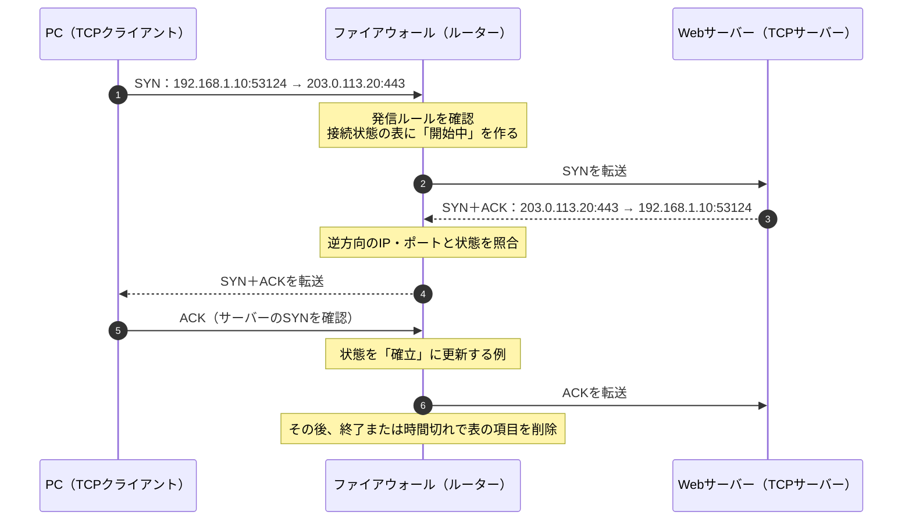

# 『おうちで学べるセキュリティの基本』2026-10-5 疑問7：ステートフルインスペクションと偽装した通信

## 疑問

> ステートフルインスペクションは偽装した通信を遮断するとあるが、偽装した通信とは例えばどのようなものか？

## 回答

**代表例は、実際には開始していない通信について「既存の通信への返答です」と装うパケットです。** ステートフルインスペクションを行うファイアウォールは、許可した通信の開始・継続・終了を記録し、後から届いたパケットがその通信に対応するかを調べます。送信元IPアドレスとTCPの `ACK` フラグを見るだけで「正しい返答」と判断するわけではありません。NISTは、通信の一部に見せかけたパケットについて、ファイアウォールが接続記録を照合する例を挙げています（[NIST SP 800-41 Rev.1、2.1.2節](https://nvlpubs.nist.gov/nistpubs/Legacy/SP/nistspecialpublication800-41r1.pdf)）。

### 通信の記録を使った判定

以下は、NATによるアドレス変換を省いた概念図です。IPアドレスは説明用の例です。

```text
家のPC                       ファイアウォール                    Webサーバー
192.168.1.10:53124                 │                       203.0.113.20:443
      │── 接続開始（SYN）───────────→│──────────────→│
      │                   許可ルールを確認し、通信を記録       │
      │←─────────────── 対応する返答（SYN, ACK）──────────────│
      │                   記録に合うので通す                 │

別の送信元（198.51.100.77:443）
          ──「返答」を装ったACK ──→│ 記録に合わないので遮断
```

ファイアウォールの記録には、通常、送信元・宛先のIPアドレス、ポート番号、通信の状態が含まれます。TCPでは `SYN → SYN, ACK → ACK` という接続開始の流れなどを追い、製品によってはシーケンス番号なども確認します。`ACK` はTCPの確認応答を示すフラグですが、**そのビットが立っていること自体は、過去に通信した証拠ではありません**（[NIST SP 800-41 Rev.1、2.1.2節](https://nvlpubs.nist.gov/nistpubs/Legacy/SP/nistspecialpublication800-41r1.pdf)、[RFC 9293：TCPの状態とACKの扱い](https://www.rfc-editor.org/rfc/rfc9293.html)）。

| 届いたパケットの例 | 接続記録との関係 | 基本的な判断 |
| --- | --- | --- |
| PCが開始した接続に対応する、Webサーバーからの返答 | IP・ポートとTCPの状態が合う | 許可する |
| PCが何も開始していないのに届く「返答」の `ACK` | 対応する記録がない | 遮断する |
| 返答元のIPをWebサーバーに偽装したが、ポートや状態が合わないパケット | 記録と一致しない | 遮断する |

最後の2行が、質問にある「偽装した通信」の具体例です。攻撃者は `ACK` を立てたり、送信元IPアドレスを書き換えたりできますが、ファイアウォールが**以前に通した通信の記録**とも照合すれば、単なる見た目の偽装は通りにくくなります。ただし、記録との照合方法や厳密さは製品・設定によって異なります（[NIST SP 800-41 Rev.1、2.1.2節](https://nvlpubs.nist.gov/nistpubs/Legacy/SP/nistspecialpublication800-41r1.pdf)）。

### 「IPアドレスを偽れない」という意味ではない

ここでいう偽装には、次のように異なる問題があります。

1. **通信の状態の偽装：** 未開始の通信を、すでに確立した通信の一部に見せる。接続記録との照合が主な対策です。
2. **送信元IPアドレスの偽装（IPスプーフィング）：** IPヘッダーに別の送信元アドレスを書く。外側の回線から届いたパケットが内側のアドレスを名乗っていないか、などを調べる**送信元アドレスのフィルタリング**も対策です。これは接続状態の確認とは別の仕組みです（[RFC 3704：Ingress Filtering](https://www.rfc-editor.org/rfc/rfc3704.html)）。

ステートフルインスペクションは、送信元の身元を暗号学的に証明する機能ではありません。攻撃者が既存の通信に見える情報を十分に合わせた場合や、通信経路上で内容を見られる場合など、これだけで全ての偽装を防ぐとはいえません。また、**正規の手順で新たに開始された悪意ある通信**は、許可ルールに合えば通ります。RFC 5961も、TCPに対する偽装パケット対策は攻撃を難しくするもので、完全な認証の代わりにはならないと説明しています（[RFC 5961、10節](https://www.rfc-editor.org/rfc/rfc5961.html)）。

UDPにはTCPのような接続開始の手順がありません。UDPを扱うステートフルファイアウォールは、送信元・宛先のIPアドレスとポート、時間切れなどから「問い合わせに対応する返答か」を判断します。例えば、PCからDNS問い合わせを送った記録があるときだけ、対応するDNS応答を通すという形です（[NIST SP 800-41 Rev.1、2.1.2節](https://nvlpubs.nist.gov/nistpubs/Legacy/SP/nistspecialpublication800-41r1.pdf)）。

**覚え方：** `ACK` や送信元IPという「パケットの自己申告」だけで信じず、**許可した通信の履歴と照合する**のがステートフルインスペクションです。IPアドレスの不自然さを調べるフィルタリングと併用して防御します。

## 追加質問1：SYNとACKの何を、どこに記録するのか？

> 通信の記録を使った判定とは、SYNとACKの状態を見ているということ？ 何をどこで記録するのか、流れを知りたい。

**TCPのSYN・ACKなどを見て接続の進行を判断する、という理解でおおむね合っています。** ただし、ファイアウォールが単に「SYNを見た」「ACKを見た」という印を付けるだけではありません。許可した通信ごとに、**誰から誰へ、どのポートで始まり、いまどの段階か**を対応付けます。製品によってはTCPのシーケンス番号も検査します（[NIST SP 800-41 Rev.1、2.1.2節](https://nvlpubs.nist.gov/nistpubs/Legacy/SP/nistspecialpublication800-41r1.pdf)）。

次の図では、PCがWebサーバーへ接続します。**この例のルーター上のファイアウォールはSYN＋ACKを生成せず、中継しながら判断します。** 分かりやすさのため、NATによるアドレス変換は省いています。



| 図の段階 | ファイアウォールが保持する情報の例 | 次のパケットの判定にどう使うか |
| --- | --- | --- |
| PCからのSYNを許可した後 | `TCP / 192.168.1.10:53124 → 203.0.113.20:443 / 開始中` | この通信に対応する逆向きのSYN＋ACKを待つ |
| サーバーからSYN＋ACKが届いた後 | 同じ通信のIP・ポートと、進んだ接続状態 | 無関係なIP・ポートからの「返答」を除外する |
| PCから最後のACKが届いた後 | 同じ通信の状態を「確立」に更新する例 | 続くデータがこの通信に属するかを調べる |

この情報は、**通信経路にあるファイアウォール自身の接続状態の表**に置かれます。家庭用ルーターならルーター内のメモリ、PCのOSのファイアウォールならそのPCのメモリで管理する一時的な情報です。パケット全部を保存する通信ログとは別のものです。Linuxの接続追跡機能にも、現在の接続項目数、TCPの状態、状態ごとの時間切れが定義されています。また、**PCとWebサーバー自身も**、ファイアウォールの表とは別にTCP接続の状態を持ちます（[Linux Kernel：conntrackの項目数・時間切れ](https://docs.kernel.org/networking/nf_conntrack-sysctl.html)、[Linux Kernel：conntrackのTCP状態](https://docs.kernel.org/netlink/specs/conntrack.html)、[RFC 9293：TCB](https://www.rfc-editor.org/rfc/rfc9293.html)）。

**注意：** 上図の「最後のACKで確立」は典型的な説明です。NISTは、ファイアウォール製品によって接続状態の扱いが異なり、完全に確立する前のパケットを通す実装もあるとしています。**ファイアウォールの「確立」表示と、両端末のTCP状態を同一視しない**ことが大切です（[NIST SP 800-41 Rev.1、2.1.2節](https://nvlpubs.nist.gov/nistpubs/Legacy/SP/nistspecialpublication800-41r1.pdf)）。

## 追加質問2：SYN＋ACKを返したクライアントがすり替わることはないか？

> サーバーがクライアントにSYN＋ACKを返しても、そのクライアントが別の相手にすり替わっている可能性はないのか？

**可能性はあります。SYN＋ACKを送っただけでは、クライアントの本人確認は終わりません。** TCPの通常の3ウェイハンドシェイクでは、クライアントがSYNを送り、サーバーがSYN＋ACKを返し、クライアントが最後のACKを返します。この最後のACKによって、サーバーは相手が応答を受け取って通信を続けられると判断します。しかし、これは**通信を成立させるための確認**であり、利用者や端末の身元を証明する認証ではありません（[RFC 9293、3.5節](https://www.rfc-editor.org/rfc/rfc9293.html)）。

| 状況 | 起こること | 分かること・分からないこと |
| --- | --- | --- |
| 攻撃者が別人のIPを送信元にしてSYNを送る | サーバーのSYN＋ACKは**名乗られたIP**へ向かう | 攻撃者が経路外にいて応答を見られなければ、通常は最後のACKを正しく返せず、接続を完成させにくい。応答しないIPを使えば、未完成の接続を増やすSYNフラッドになり得る |
| 攻撃者が通信経路上で応答を見たり、通信を転送・改ざんできたりする | 応答を利用して接続を乗っ取る可能性がある | TCPの握手やファイアウォールの接続表だけでは本人確認にならない |
| 攻撃者が正規のクライアント端末・アカウントを乗っ取っている | 正しい手順でTCP接続を始められる | 握手が正常でも、利用者が正当とは限らない |

送信元IPを偽ったSYNに対し、サーバーが偽装されたアドレスへSYN＋ACKを返すこと、未完成の接続を利用した攻撃はRFC 4987に記載されています。既存のTCP接続に偽装パケットを混ぜる攻撃も研究されており、TCPの状態確認だけで全て防げるわけではありません（[RFC 4987、2～3節](https://www.rfc-editor.org/rfc/rfc4987.html)、[RFC 5961、10節](https://www.rfc-editor.org/rfc/rfc5961.html)）。

相手の身元が必要なら、TCPの上で認証を行います。Webサイトの**サーバー**を確認する場合は、HTTPS/TLSで証明書を検証します。サービスが**クライアント**を確認する場合は、ログイン認証や、必要に応じてクライアント証明書を使います。TLSのクライアント証明書は、サーバーが要求した場合に使う仕組みです（[RFC 8446、4章](https://www.rfc-editor.org/rfc/rfc8446.html)）。

**区別する点：** ファイアウォールの接続表は「この通信の続きか」、TCPの握手は「応答を受け取って続けられるか」、サービスの認証は「誰が利用しているか」を扱います。

関連：[疑問8：パケットフィルタリングでIPを知らなくても守れる理由](./basic_security_at_home_20261005_question8_packet_filtering.md)
