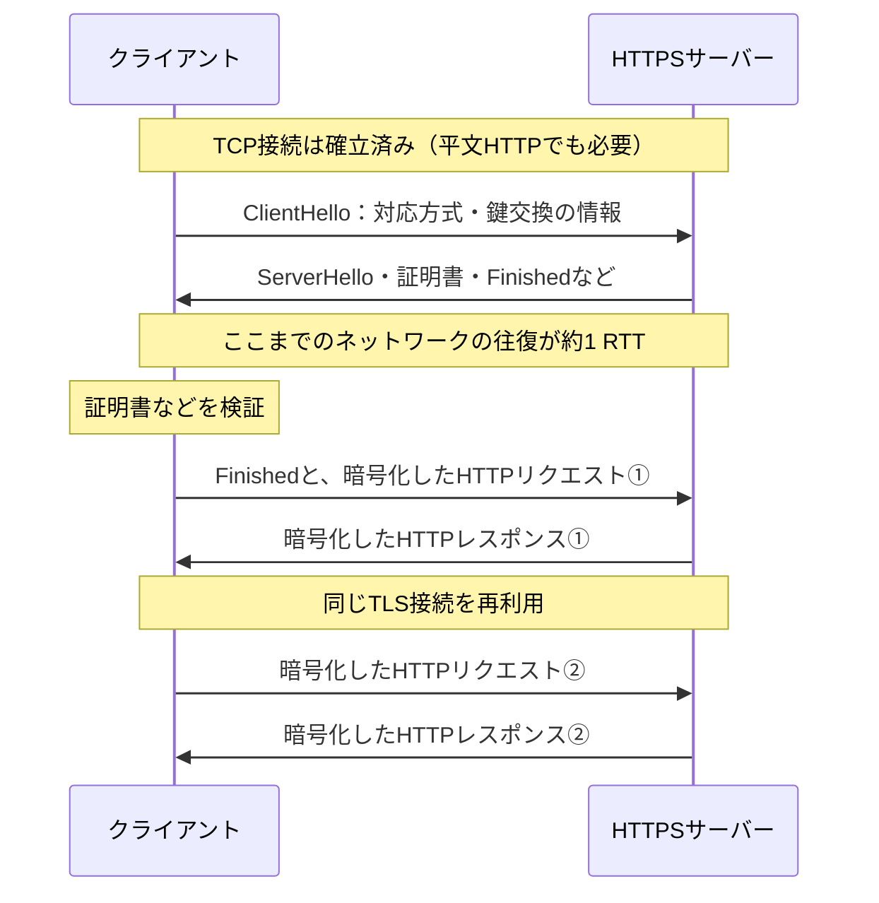

# 『おうちで学べるセキュリティの基本』2026-10-5 疑問9の追加質問：WebアプリでHTTPSを構築できるライブラリ

## 追加質問

> WebアプリケーションのライブラリでHTTPSを構成できるものはありますか？HTTPであればたくさんある気がしますが、HTTPSはあまりないような気がします。調査して具体的に構築できるライブラリをあげてください。

## 回答

**あります。** ここではWebアプリを公開するサーバー側を扱います。WebアプリがTCP上のHTTPSを提供するときは、HTTPのリクエストを扱う機能と、TLSで接続を保護する機能を組み合わせます。両方を一つのAPIで提供するものも、WebフレームワークとTLS対応サーバーを組み合わせるものもあります。「HTTPS」という名前のWebフレームワークを別に探す必要はありません。Node.jsの公式文書もHTTPSを「TLS上のHTTP」と説明しています（[Node.js：HTTPS](https://nodejs.org/api/https.html)）。

```text
ブラウザ ── HTTPS（TLSで保護したHTTP）──> HTTPSサーバー
                                         ├─ TLS：接続の確立・暗号化／復号
                                         └─ HTTP：URLの振り分け・応答の生成
```

ExpressのようにHTTPの経路を定義するライブラリでは、TLSのAPIが目立たないことがあります。Expressの`app.listen()`はHTTPサーバーを作るため、アプリが直接HTTPSを受ける場合はNode.jsの`https.createServer()`にExpressの`app`を渡します。Expressの公式文書もこの構成を示しています（[Express：`app.listen()`の説明](https://expressjs.com/en/4x/api/application/#app.listen)、[Node.js：`https.createServer()`](https://nodejs.org/api/https.html#httpscreateserveroptions-requestlistener)）。

### HTTPSサーバーを構築できる具体例

| 言語・環境 | ライブラリ／フレームワーク | HTTPSにする方法 |
| --- | --- | --- |
| JavaScript／Node.js | [標準の`node:https`](https://nodejs.org/api/https.html#httpscreateserveroptions-requestlistener) ＋ [Express](https://expressjs.com/en/4x/api/application/#app.listen) | 証明書と秘密鍵を渡して`https.createServer(options, app)`を呼ぶ。ExpressがHTTPの経路を処理する |
| Python | [aiohttpのWebサーバー](https://docs.aiohttp.org/en/stable/web_reference.html#aiohttp.web.run_app) ＋ [標準の`ssl`](https://docs.python.org/3/library/ssl.html#ssl.SSLContext.load_cert_chain) | 証明書・秘密鍵を設定した`ssl.SSLContext`を`web.run_app(app, ssl_context=context)`へ渡す |
| Go | [標準の`net/http`](https://pkg.go.dev/net/http#ListenAndServeTLS) | `http.ListenAndServeTLS(":8443", "cert.pem", "key.pem", handler)`を呼ぶ |
| Java | [Spring Bootの組み込みWebサーバー](https://docs.spring.io/spring-boot/how-to/webserver.html#howto.webserver.configure-ssl) | `server.ssl.*`で証明書と秘密鍵を設定し、HTTPSで待ち受ける |
| C#／.NET | [ASP.NET CoreのKestrel](https://learn.microsoft.com/en-us/aspnet/core/fundamentals/servers/kestrel/endpoints?view=aspnetcore-10.0#configure-https) | HTTPSエンドポイントと証明書を設定する。コードでは`UseHttps()`も使える |

Expressを使う場合の最小例です。`server-key.pem`と`server-cert.pem`は、対応する秘密鍵とサーバー証明書を**あらかじめ用意したファイル**です。`app.get()`がHTTPの経路、`https.createServer()`がTLS付きの待ち受けを担当します（[Expressの公式例](https://expressjs.com/en/4x/api/application/#app.listen)、[Node.jsの公式例](https://nodejs.org/api/https.html#httpscreateserveroptions-requestlistener)）。

```js
const express = require('express');
const https = require('node:https');
const fs = require('node:fs');

const app = express();
app.get('/', (_req, res) => res.send('Hello HTTPS'));

https.createServer({
  key: fs.readFileSync('server-key.pem'),
  cert: fs.readFileSync('server-cert.pem'),
}, app).listen(8443);
```

### アプリの外側でTLSを処理する構成

実運用では、CaddyやNginxなどのリバースプロキシでHTTPSを受け、Webアプリへ転送する構成もあります。これならアプリのコードにHTTPSの起動処理が見えなくても、ブラウザからプロキシまでの通信はHTTPSです。**プロキシからアプリまでの区間は別の通信**なので、HTTPで転送する設定ならその区間は暗号化されません（[Caddy：HTTPS対応のリバースプロキシ](https://caddyserver.com/docs/quick-starts/reverse-proxy)、[Nginx：HTTPSサーバーの設定](https://nginx.org/en/docs/http/configuring_https_servers.html)）。

```text
ブラウザ ── HTTPS ──> リバースプロキシ（TLSを終端） ── HTTPまたはHTTPS ──> Webアプリ
```

つまり、**「Webアプリ自身がTLSを終端する」方法と「手前のサーバーがTLSを終端する」方法の両方があります。** フレームワークの説明にHTTPの記述しかなくても、どの機器・ソフトウェアでTLSを終端するかを確認すると、HTTPSの構成が見えてきます。

## 追加質問：アプリ側とプロキシ側でTLSを処理すると、何が違う？

> 1. アプリ側でTLSを構築する場合と、アプリの外側でTLSを構築する場合を、暗号化される範囲が分かる図で見たいです。
> 2. それぞれのメリット・デメリットは何ですか？ アプリ側でTLSを構築した方が、アプリとリバースプロキシの間も暗号化されて安全ではないでしょうか？

**ポイントは「TLSをどこで終端（復号）するか」と「プロキシからアプリへ何の通信方式で送るか」です。** アプリにTLS機能があっても、プロキシからアプリへの転送をHTTPに設定すれば、その区間は暗号化されません。逆に、プロキシでブラウザ側のTLSを終端しても、アプリへの転送をHTTPSに設定すれば、両区間の通信を暗号化できます（[Caddy：上流へのHTTP/HTTPS転送](https://caddyserver.com/docs/caddyfile/directives/reverse_proxy)、[NGINX：TLS終端と再暗号化](https://docs.nginx.com/nginx/deployment-guides/migrate-hardware-adc/f5-big-ip-configuration/)）。

### どこまで暗号化されるか

以下は**TCP上のHTTPS**の例です。`════`の区間はHTTPの内容がTLSで保護され、`────`の区間はHTTPの内容が平文で流れます。TLSで保護される区間でも、転送に必要なIPアドレスやTCPポート番号までTLSで暗号化されるわけではありません（[TLSとパケットのカプセル化](./basic_security_at_home_20261005_question9_tls_encapsulation.md)）。

```text
A. アプリがTLSを終端する（プロキシなし、またはTLSを復号しないTCP中継）
   ブラウザ ════ TLS ════ [TCP中継プロキシ：任意・復号しない] ════ 同じTLS ════ [アプリ：復号]
                     ↑ ブラウザからアプリまでHTTPの内容を暗号化 ↑

B. プロキシがTLSを終端し、アプリへHTTPで転送する
   ブラウザ ════ TLS ════ [プロキシ：復号] ──── HTTP ──── [アプリ]
                 暗号化された区間              平文の区間

C. プロキシがTLSを終端し、アプリへHTTPSで転送する（再暗号化）
   ブラウザ ════ TLS接続① ════ [プロキシ：復号→再暗号化] ════ TLS接続② ════ [アプリ：復号]
                 暗号化された区間               別の暗号化された区間
```

AのTCP中継プロキシはTLSの中身を復号せず、そのままアプリへ渡します。そのためHTTPのURLパスや本文を見た振り分けはできませんが、TLSの接続開始時に得られる情報などを使った振り分けは可能です（[NGINX：TLSを終端せずにSNIなどを読む仕組み](https://nginx.org/en/docs/stream/ngx_stream_ssl_preread_module.html)）。Cでは**途中に平文のネットワーク区間はありませんが、プロキシの内部ではHTTPの内容が一度復号されます**。ブラウザからアプリまで一つのTLS接続が続くわけではなく、①と②は別のTLS接続です（[NGINX：再暗号化の説明](https://docs.nginx.com/nginx/deployment-guides/migrate-hardware-adc/f5-big-ip-configuration/)）。

### メリットとデメリット

| 構成 | メリット | デメリット・注意点 |
| --- | --- | --- |
| A：アプリでTLSを終端 | ブラウザからアプリまで同じTLS通信を保てる。TCP中継プロキシはHTTPの内容を読めない | アプリ側で証明書・秘密鍵の管理が必要。中継プロキシではURLパスなどHTTPの内容に基づく処理ができない |
| B：プロキシでTLSを終端→アプリへHTTP | アプリ側のTLS設定が不要。プロキシに証明書管理やHTTPの振り分けをまとめられる | プロキシとアプリの間は平文。この区間を通る通信を盗聴・改ざんされるリスクを別途評価する必要がある |
| C：プロキシでTLSを終端→アプリへHTTPS | 両方のネットワーク区間を暗号化しながら、プロキシでHTTPの振り分けもできる | プロキシはHTTPの内容を読める。アプリ側の証明書、プロキシ側の接続設定・証明書検証など、運用する項目が増える |

この比較は、[Caddyの証明書自動管理](https://caddyserver.com/docs/automatic-https)、[CaddyのHTTP転送とHTTPS転送](https://caddyserver.com/docs/caddyfile/directives/reverse_proxy)、[NGINXのTLSを終端しない転送](https://nginx.org/en/docs/stream/ngx_stream_ssl_preread_module.html)、[NGINXの再暗号化](https://docs.nginx.com/nginx/deployment-guides/migrate-hardware-adc/f5-big-ip-configuration/)から、各構成で必要になる機能と設定を整理したものです。

**「アプリ側のTLSなら必ずより安全」とは言い切れません。** プロキシとアプリが別のホストにあり、その間のネットワークも保護したいなら、AのようにTLSをアプリまで通すか、Cのようにプロキシからアプリへの通信もHTTPSにします。一方、BのようにHTTPで転送する場合は、その区間を暗号化しない設計です。どの区間の盗聴・改ざんを防ぐ必要があるかで選びます。Cでもプロキシ自身には平文が見えるため、**プロキシにも内容を見せたくない**要件ならAが適します（[NGINX：各構成と上流ネットワークの考え方](https://docs.nginx.com/nginx/deployment-guides/migrate-hardware-adc/f5-big-ip-configuration/)）。

Cを選ぶときは、**プロキシがアプリ側の証明書を検証すること**も確認します。たとえばNGINXでは、上流HTTPSサーバーの証明書を検証する`proxy_ssl_verify`の既定値は`off`です。必要に応じて信頼するCAを指定し、検証を有効にします（[NGINX：`proxy_ssl_verify`の既定値](https://nginx.org/en/docs/http/ngx_http_proxy_module.html#proxy_ssl_verify)、[NGINX：上流サーバーの証明書検証設定](https://docs.nginx.com/nginx/admin-guide/security-controls/securing-http-traffic-upstream/)）。

## 追加質問：A・Cの方が安全？ 暗号化はサーバーだけの役割？

> 1. クライアントからオリジンサーバーまで暗号化されるAまたはCが良いと思います。Bの平文区間では盗聴されませんか？
> 2. 暗号化はクライアント側ではなくサーバーで設定するもので、サーバーがHTTPSを使うと決めたらクライアントが従う、という理解で良いですか？

### 1. A・Cを選びたい、という考え方について

**プロキシとアプリが別のホストにあり、その間の通信を盗聴・改ざんされる可能性を減らしたいなら、AまたはCを選ぶ考え方は妥当です。** BではプロキシがTLSを復号した後、アプリへのHTTPリクエストと応答がその区間を平文で通ります。その区間を観測・操作できる人や機器があれば、通信内容を読まれたり変えられたりする可能性があります。OWASP ASVSも、内部のHTTPサービス間でTLSなどの適切な通信路暗号化を用いることを確認項目にしています（[OWASP ASVS 5.0、12.3.3](https://github.com/OWASP/ASVS/blob/v5.0.0/5.0/en/0x21-V12-Secure-Communication.md)、[NGINX：平文転送と再暗号化の違い](https://docs.nginx.com/nginx/deployment-guides/migrate-hardware-adc/f5-big-ip-configuration/)）。

ただし、**AとCの保護範囲は同じではありません。** AではブラウザとアプリがTLSの両端なので、途中のTCP中継プロキシはHTTPの内容を復号できません。Cではブラウザとプロキシ、プロキシとアプリがそれぞれ別のTLS接続を作ります。両区間の通信は暗号化されますが、プロキシは中継のために一度復号し、HTTPの内容を読めます。URLパスでの振り分けなどが必要ならC、プロキシにもHTTPの内容を見せないならA、という違いがあります（[NGINX：TLS終端と再暗号化](https://docs.nginx.com/nginx/deployment-guides/migrate-hardware-adc/f5-big-ip-configuration/)、[NGINX：TLSを復号しない中継](https://nginx.org/en/docs/stream/ngx_stream_ssl_preread_module.html)）。

Bも、プロキシとアプリが**同じホスト内のUnixソケットやループバック**で通信する場合などは、別ホスト間を平文で流す場合とはリスクが異なります。これは通信経路からの判断であり、「Bなら常に安全」という意味ではありません。どの区間を誰が観測できるかを確認して選びます。なお、A・CでもTLSの接続先を正しく認証する必要があります。特にCでは、前述のとおりプロキシがアプリ側の証明書を検証する設定が重要です（[Caddy：Unixソケット・ループバック・HTTPSの転送先](https://caddyserver.com/docs/caddyfile/directives/reverse_proxy)、[OWASP ASVS 5.0、12.3.2〜12.3.4](https://github.com/OWASP/ASVS/blob/v5.0.0/5.0/en/0x21-V12-Secure-Communication.md)）。

### 2. HTTPSを使うときのクライアントとサーバーの役割

**サーバー側のHTTPS設定は必要ですが、暗号化はクライアントとサーバーの両方で行います。** クライアント（ブラウザ）は`https://`の宛先への安全な接続を開始し、サーバーの証明書が接続先に合うかを検証します。サーバーはTLSを受け付ける設定と証明書・秘密鍵を用意します。TLSのハンドシェイクで双方が使える方式を調整し、その後は**クライアントが送るHTTPリクエストも、サーバーが返すHTTPレスポンスも**それぞれの送信側で暗号化します。対応する方式で合意できなければ接続は成立しません（[RFC 9110、4.2.2節・4.3.4節](https://www.rfc-editor.org/rfc/rfc9110.html#section-4.2.2)、[RFC 8446、2節・4.1節](https://www.rfc-editor.org/rfc/rfc8446.html#section-2)）。

```text
ブラウザ（TLSクライアント）                     HTTPSサーバー（TLSサーバー）
  https:// へ接続・ClientHello  ────────────────>  ClientHelloを受け取る
  証明書などを受け取る            <───────────────  対応方式を選び、証明書を送る
  証明書を検証し、双方が通信鍵を計算して接続を確立する
  HTTPリクエストを暗号化         ════════════════>  復号して処理
  HTTPレスポンスを復号           <════════════════  応答を暗号化
```

サーバーは平文HTTPを受け付けず、HTTPSを使えないクライアントからの接続を拒むこともできます。HTTPからHTTPSへ**リダイレクト**する設定もできますが、最初に`http://`で送ったリクエスト自体はTLSで保護されません。ブラウザがそのサイトのHSTSポリシーを既に知っている場合などは、HTTPリクエストを送る前にHTTPSへ切り替えられます。つまり、サーバーが一方的に暗号化を始め、クライアントが受け身で従うわけではありません（[OWASP ASVS 5.0、12.2.1](https://github.com/OWASP/ASVS/blob/v5.0.0/5.0/en/0x21-V12-Secure-Communication.md)、[Caddy：HTTPからHTTPSへのリダイレクト](https://caddyserver.com/docs/automatic-https)、[RFC 6797：HSTSと初回HTTPの問題](https://www.rfc-editor.org/rfc/rfc6797.html#section-14.6)）。

Cの構成では、**プロキシが二つの役割を持ちます。** ブラウザとの接続ではTLSサーバー、アプリとの接続ではTLSクライアントです。そのため、プロキシもアプリ側の証明書を検証する立場になります（[NGINX：上流HTTPSサーバーへの接続と証明書検証](https://docs.nginx.com/nginx/admin-guide/security-controls/securing-http-traffic-upstream/)）。

## 追加質問：TLSで増える待ち時間と、通信方式を決める役割

> 1. 全てを暗号化したほうが良いですが、TLS分だけ、リクエストからレスポンスまでの時間が長くなるという認識で良いですか？
> 2. 確認なんですが。プロトコルを決めるのはサーバーですよね？
> 3. サーバーがHTTPSを要求したのに、クライアントがHTTPを受け付けないことはあるんですか？

### 1. TLSの処理で、どれくらい時間が増える？

**TLSによる追加の処理はあります。ただし、「すべてのリクエストが、毎回同じ時間だけ遅くなる」という理解ではありません。** 接続開始時の**ハンドシェイク**（使う方式の調整、鍵交換、接続先の認証）と、接続後の**暗号化・復号・改ざん検出**を分けて考えます。証明書やTLSの制御情報などで、送るデータ量も増えます（[RFC 8446：ハンドシェイク](https://www.rfc-editor.org/rfc/rfc8446.html#section-2)、[RFC 8446：データの保護](https://www.rfc-editor.org/rfc/rfc8446.html#section-5.2)）。

ここでは前節と同じ**TCP上のHTTPS**を扱います。ブラウザやAPI呼び出しの開始から応答までを測るなら、接続準備の時間も含みます。一方、確立済みの接続で「HTTPリクエストを送ってから応答を受け取るまで」だけを測るなら、最初のハンドシェイクは既に終わっています。

| 接続の状態 | TLSの追加負荷と待ち時間 |
| --- | --- |
| 新しい接続を作る | HTTPデータを送る前にハンドシェイクが必要。通常のTLS 1.3では、TCP接続後におよそ1 RTTの待ち時間と、鍵交換・認証などの処理が加わる |
| 確立済みの接続を再利用する | リクエストごとのハンドシェイクは不要。データの暗号化・復号などの処理は必要だが、TLSのために毎回1 RTT待つわけではない |

**RTT（Round Trip Time）は、通信が相手へ届き、その返事が戻るまでの往復時間です。** 次の図は、TLS 1.3で鍵交換の情報を送り直すための`HelloRetryRequest`や、後述の0-RTTを使わない通常の流れを簡略化したものです。平文HTTPならTCP接続後にリクエストを送れますが、このHTTPSの例では、その前にTLSのやり取りが入ります（[RFC 8446、2節の図1・2.1節](https://www.rfc-editor.org/rfc/rfc8446.html#section-2)）。



たとえばRTTが50 msなら、この条件での初回のTLSのやり取りには、ネットワークの待ち時間だけでおよそ50 msが追加される、と見積もれます。これは図からの概算であり、実測値ではありません。実際の時間には、計算、証明書などの転送、通信の混雑なども影響します。**2回目以降も毎回50 ms増える、という意味ではありません。** HTTP/1.1では一つの接続で複数のリクエストと応答を扱う持続接続が標準で、NGINXもHTTPSの負荷を減らす方法として接続の再利用を説明しています（[RFC 9112：持続接続](https://www.rfc-editor.org/rfc/rfc9112.html#section-9.3)、[NGINX：HTTPSの性能改善](https://nginx.org/en/docs/http/configuring_https_servers.html#https_server_optimization)）。

前節の**CではTLS接続が二つあるため、プロキシでも復号・再暗号化の処理が加わります。** ただし、ブラウザ側もアプリ側も接続を再利用できます。「毎回二つのハンドシェイクを行う」「応答時間がAの2倍になる」とは限りません。特にプロキシとアプリの間では、既に接続した通信路を保存して次の転送に使えます。これは、前節のCの構成と接続再利用の仕組みからの整理です（[NGINX：上流への接続の再利用](https://nginx.org/en/docs/http/ngx_http_upstream_module.html#keepalive)）。

負荷を抑える仕組みには、次の違いがあります。

- **接続の再利用**：既に確立したTCP/TLS接続で、次のHTTPリクエストを送る。新しい接続のハンドシェイクは不要。
- **TLSセッションの再開**：以前の接続で得た情報を使い、**新しい接続**のハンドシェイクを簡略化する。接続の再利用とは別の仕組みで、通常のTLS 1.3では再開時も往復の待ち時間は残る。
- **0-RTT**：条件を満たす再接続で、サーバーの返事を待たずに一部のデータを送る仕組み。ただし同じ送信内容を攻撃者に再送される「リプレイ」の問題があるため、決済などに無条件で使うものではない。

接続の再利用は[NGINXの公式文書](https://nginx.org/en/docs/http/configuring_https_servers.html#https_server_optimization)、セッションの再開と0-RTTは[RFC 8446、2.2・2.3節](https://www.rfc-editor.org/rfc/rfc8446.html#section-2.2)に基づきます。性能を判断するときは、同じ通信経路・HTTPバージョンで、**新規接続と接続再利用を分けて測定**します。暗号化する区間は前節の保護要件から選び、接続の再利用などで負荷を抑える、という順序で考えると整理できます。

### 2. プロトコルはサーバーが決める？

**サーバーは「どの方式を提供・許可するか」を設定しますが、通信の成立にはクライアント側の選択と対応も必要です。** 「プロトコルを決める」という言葉には、次の異なる話が含まれています。

| 決めるもの | クライアントの役割 | サーバーの役割 |
| --- | --- | --- |
| 平文HTTPかHTTPSか | URLの`http://`・`https://`やクライアントの設定に応じて、どの方式で接続を始めるかを決める | 平文HTTP・HTTPSのどちらで待ち受けるか、HTTPを拒むか、HTTPSへ誘導するかを設定する |
| TLSのバージョン・暗号方式 | 対応し、使用を許可する候補を`ClientHello`で知らせる | クライアントが提示した候補から、自分も対応・許可する方式を選ぶ。共通の方式がなければ失敗する |
| TLS上のHTTPのバージョン | ALPNという仕組みで、たとえば`h2`（HTTP/2）や`http/1.1`を提示する | 提示された候補から対応するものを選ぶ。HTTP/2などの選択にも双方の対応が必要 |

HTTPとHTTPSの接続開始は[RFC 9110、4.2.1・4.2.2節](https://www.rfc-editor.org/rfc/rfc9110.html#section-4.2.1)、TLSの方式選択は[RFC 8446、4.1.1節](https://www.rfc-editor.org/rfc/rfc8446.html#section-4.1.1)、ALPNの選択は[RFC 7301、3.2節](https://www.rfc-editor.org/rfc/rfc7301.html#section-3.2)に基づきます。ALPNは「TLSで保護した接続の中で、どのアプリケーションプロトコルを使うか」を調整する仕組みで、平文HTTPをHTTPSへ切り替える仕組みではありません。

たとえば、HTTPS専用の待ち受け先に平文のHTTPリクエストを送っても、自動的にTLS通信になるわけではありません。クライアントはHTTPデータを送る前にTLS接続を確立する必要があり、この場合は通信方式の不一致になります（[RFC 9110、4.2.2節](https://www.rfc-editor.org/rfc/rfc9110.html#section-4.2.2)）。

たとえば、**サーバーがTLS 1.3だけを許可し、クライアントがTLS 1.2までしか対応していなければ、TLS接続は成立しません。** サーバーが対応していても、クライアントが使えない方式を一方的に強制することはできません（[RFC 8446：対応バージョンの選択](https://www.rfc-editor.org/rfc/rfc8446.html#section-4.2.1)）。

また、`http://`で接続した後にサーバーからHTTPSへのリダイレクトを受けた場合は、**クライアントが`https://`へ新たに接続する**ことで切り替わります。最初のHTTP通信が後から暗号化されるわけではありません。リダイレクトへの自動追従も、すべてのクライアントに必須の動作ではありません（[RFC 9110：HTTPSへの接続](https://www.rfc-editor.org/rfc/rfc9110.html#section-4.2.2)、[RFC 9110：リダイレクトへの追従](https://www.rfc-editor.org/rfc/rfc9110.html#section-15.4)）。

### 3. サーバーがHTTPSを要求しても、クライアントが対応しないことはある？

質問の「HTTPを受け付けない」を記載どおりに読むと、**クライアントが平文HTTPを使わず、HTTPSだけを許可することはあります。** これはサーバーの「HTTPSだけを許可する」設定と両立します。たとえばcurlには、クライアント側で許可する通信方式を制限する`--proto`があります（[curl：`--proto`](https://curl.se/docs/manpage.html#--proto)）。

```sh
# この呼び出しではHTTPSだけを許可する。http://のURLは拒否する。
curl --proto '=https' https://example.com/
```

一方、質問の意図が**「サーバーがHTTPSを要求しても、クライアントがHTTPSを使えない／接続を拒むことはあるか」**であれば、答えは**あります**。HTTPSでの接続を開始できることと、安全な接続として成立することも別です。

| 状況 | 何が起こるか |
| --- | --- |
| クライアントにHTTPS/TLSの実装がない、または使用を禁止している | HTTPSへの接続を開始できない |
| TLSのバージョン・暗号方式に共通の候補がない | ハンドシェイクが失敗し、HTTPデータを送受信できない |
| サーバーの証明書を信頼できない、または接続先の名前と証明書が一致しない | 証明書検証を行うクライアントがエラーとして拒否する。curlも既定で検証する |
| HTTPからHTTPSへのリダイレクトに自動追従しない設定 | HTTPのリダイレクト応答を受け取って終了し、HTTPSへの接続を始めない。これはTLSの失敗とは別 |

方式の不一致は[RFC 8446、4.1.1節](https://www.rfc-editor.org/rfc/rfc8446.html#section-4.1.1)、クライアント側の方式制限は[curlの`--proto`](https://curl.se/docs/manpage.html#--proto)、証明書検証の例は[curlの証明書検証の説明](https://curl.se/docs/sslcerts.html)、リダイレクトの扱いは[RFC 9110、15.4節](https://www.rfc-editor.org/rfc/rfc9110.html#section-15.4)に基づきます。

**サーバーがHTTPSだけを許可するとは、「条件を満たすクライアントとのHTTPS通信だけを受け入れる」ということです。** 接続できないクライアントを自動的にHTTPS対応にする、という意味ではありません。

## 追加質問：クライアントのTLS実装と、TCP・TLSの接続順序

クライアントのTLSは、OS提供のAPIや、ブラウザ・アプリが利用するTLSライブラリに実装されています。通常のTCP上のHTTPSでは、**3-wayハンドシェイクでTCP接続を確立し、その上でTLSハンドシェイクを行ってからHTTPを送受信します。** TCPの成功とTLSの成功は別で、TLSの方式が合わなければ、成立済みのTCP接続を終了します。

今回の追加質問と詳しい回答は、[クライアントのTLS実装とTCP・TLSの接続順序](./basic_security_at_home_20261005_question9_tls_client_handshake.md)にまとめました。実装例の表、成功時・TLSのバージョン不一致時のシーケンス図、APIが報告する「接続成功」の違いを説明しています。

関連：[カプセル化・非カプセル化の実装とTLSの役割](./basic_security_at_home_20261005_question9_encapsulation_implementation.md)
