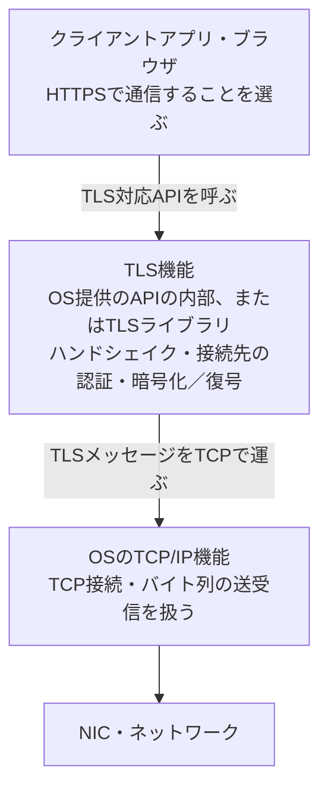
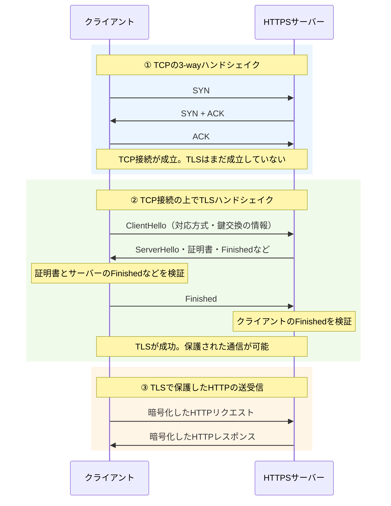
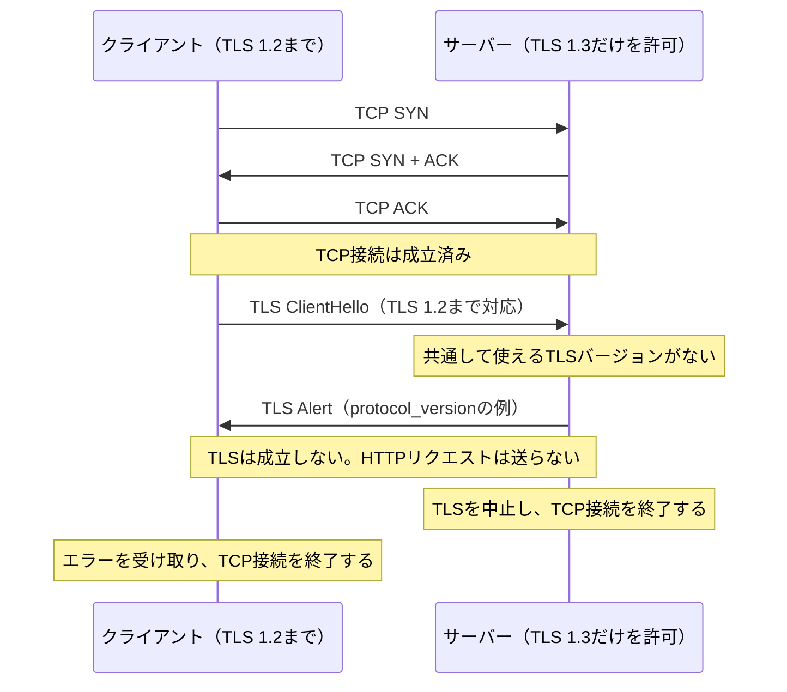

# 『おうちで学べるセキュリティの基本』2026-10-5 疑問9の追加質問：クライアントのTLS実装とTCP・TLSの接続順序

## 追加質問

> 1. クライアントのTLSはどこに実装されているんですか？OSですか？ この実装がなければ、TLSを使用できないということですか？
> 2. TLSハンドシェイクは3wayハンドシェイクの後に行われるんですよね？ もし、クライアント側でTLSバージョンがずれていたり、使用できない場合は、3wayハンドシェイクで通信が確立した後に、再度、接続を切るという流れになりますか？ それともTLSのハンドシェイクが成功するまで接続を確立しないんですか？ 個人的な認識では、3WayハンドシェイクでHTTPの接続が確立した上で、TLSのハンドシェイクが行われると思っています。この辺りをシーケンスに示して説明してください。

## 回答

**クライアント側にもTLSの実装が必要ですが、実装場所はOSだけとは限りません。** また、接続の順序については、**通常のTCP上のHTTPSでは「TCP接続の確立 → TLSの確立 → HTTPの送受信」です。** 3-wayハンドシェイクで確立するのはTCP接続です。「HTTP接続を先に確立してからTLSを追加する」と捉えると、接続の状態を混同しやすくなります。

### 1. クライアントのTLSはどこに実装される？

**OSが提供するTLS機能を使う場合と、アプリ・ブラウザ・言語の実行環境がTLSライブラリを使う場合があります。** これはサーバー側と同じです。TLSライブラリは、クライアントとして接続を始める処理と、サーバーとして接続を受ける処理を提供できます。Pythonの`ssl`も、OpenSSLを使い、クライアントとサーバーの両方を扱います（[Python：`ssl`の概要](https://docs.python.org/3/library/ssl.html)）。

| 利用するアプリ・環境の例 | TLSの実装・利用方法 | OSとの関係 |
| --- | --- | --- |
| WindowsのSchannelを使うアプリ | SSPIというAPIを通じてSchannelのTLS機能を使う | OSが提供するTLS実装を利用する |
| macOS・iOSなどで`URLSession`や`Network framework`を使うアプリ | APIの内部にあるTLS機能を使う | OS提供のネットワークAPIからTLSを利用する |
| Chrome/Chromiumで使われるBoringSSL | ブラウザ側の通信処理がTLSライブラリを使う | アプリがTLSライブラリを組み込む例。すべてのアプリがOSのTLS APIを使うわけではない |
| Pythonの`ssl`を使うクライアント | `SSLContext`などからOpenSSLを使う | 言語の標準ライブラリからTLSライブラリを利用する |

実装例の出典：[Microsoft：SchannelとSSPI](https://learn.microsoft.com/en-us/windows-server/security/tls/tls-ssl-schannel-ssp-overview)、[Apple：TLSを扱うネットワークAPI](https://developer.apple.com/documentation/technotes/tn3151-choosing-the-right-networking-api)、[BoringSSL：Chrome/Chromiumでの利用](https://boringssl.googlesource.com/boringssl/+/HEAD/README.md)、[Python：`ssl`](https://docs.python.org/3/library/ssl.html)。実際に使う実装は、アプリやプラットフォーム、ビルド構成によって異なります。

次の図は、クライアントがデータを送るときの役割分担です。OS提供のAPIでも、その処理がすべてカーネル内で実行される、という意味ではありません。

**TLS接続の端点になるには、利用できるTLS実装がどこかに必要です。** ただし、アプリ開発者がTLSの暗号処理を自作する必要はありません。HTTPS対応のAPIやライブラリを呼べば、その内部のTLS実装を利用できます。逆に、**通常のTCPソケットを作って443番ポートにつなぐだけではTLS通信になりません。** ポート番号は接続先の指定であり、TLSを自動で実行する命令ではありません（[Apple：BSDソケットはTLSを直接提供しない](https://developer.apple.com/documentation/technotes/tn3151-choosing-the-right-networking-api)、[Python：TCPソケットをTLSで包むクライアント例](https://docs.python.org/3/library/ssl.html#socket-creation)）。

Linuxには`kTLS`もありますが、これは主にTLSレコードの送受信処理をカーネルへ任せる仕組みです。**`kTLS`だけで接続開始時のTLSハンドシェイクまで自動で完了するわけではありません。** ユーザー空間のTLSライブラリなどでハンドシェイクを行い、得られた鍵などをカーネルに設定する構成です（[Linux Kernel：kTLSとユーザー空間のTLSライブラリ](https://docs.kernel.org/networking/tls.html#integrating-in-to-userspace-tls-library)）。

### 2. TCPとTLSは、何をそれぞれ確立する？

**TCP接続の成功とTLSの成功は、別の段階です。** TCPはバイト列を順序どおりに運ぶための通信路を作ります。TCPの3-wayハンドシェイクでは、TLSのバージョンやサーバー証明書は検証しません。その通信路の上でTLSのメッセージを交換し、通信の保護に必要な方式・鍵・認証を扱います（[RFC 9293：TCPの接続確立](https://www.rfc-editor.org/rfc/rfc9293.html#section-3.5)、[RFC 8446：TLSのハンドシェイク](https://www.rfc-editor.org/rfc/rfc8446.html#section-2)）。

| 段階 | TCPの状態 | TLSの状態 | HTTPSのHTTPリクエストを送れる？ |
| --- | --- | --- | --- |
| TCPの3-wayハンドシェイク中 | 接続の確立中 | 未開始 | まだ送らない |
| TCP接続が成立し、TLSを準備中 | `ESTABLISHED`（接続済み） | 未開始・ハンドシェイク中 | 通常はまだ送らない |
| TLSが成功 | TCP接続は成立済み | 暗号化・認証された通信が可能 | TLSで保護して送れる |
| TLSが致命的なエラーで失敗 | 一度成立したTCP接続を終了する | 成立しない | 送れない |

この表と以降の図は、**新しいTCP接続でTLS 1.3を使う通常のHTTPS通信**を扱います。0-RTTやTCP Fast Openなどの最適化は含めません。TLS 1.3の0-RTTでは一部のデータを早く送れる場合がありますが、別途制約があります（[RFC 8446：0-RTT](https://www.rfc-editor.org/rfc/rfc8446.html#section-2.3)）。HTTP/3はQUIC/UDP上の通信なので、TCPの3-wayハンドシェイクを行うこの図とは異なります（[RFC 9114：HTTP/3の接続](https://www.rfc-editor.org/rfc/rfc9114.html#section-3)）。

### 3. 成功する場合のシーケンス

DNSによる接続先の決定などは済んでいるものとし、TCP・TLS・HTTPの順序に絞った図です。TCPの矢印は主にOSのTCP機能、TLSの矢印は前述のTLS実装が扱います。

TCPは[RFC 9293、3.5節の図6](https://www.rfc-editor.org/rfc/rfc9293.html#section-3.5)、TLSは[RFC 8446、2節の図1](https://www.rfc-editor.org/rfc/rfc8446.html#section-2)を基に簡略化しています。HTTPSのリクエストを送る前に通信を保護する必要があることは、[RFC 9110、4.2.2節](https://www.rfc-editor.org/rfc/rfc9110.html#section-4.2.2)で定められています。

**各矢印が、必ず別々のパケットになるわけではありません。** たとえば、3-wayハンドシェイク最後のACKと`ClientHello`のデータが同じTCPセグメントに入る場合があります。図は処理の段階を分けて示しています。厳密なTCPの状態遷移では、クライアントはSYN＋ACKを受け取って`ESTABLISHED`へ移り、サーバーは最後のACKを受け取って`ESTABLISHED`へ移ります（[RFC 9293、3.5節](https://www.rfc-editor.org/rfc/rfc9293.html#section-3.5)）。

したがって、元の認識は**「3-wayハンドシェイクでTCP接続を確立し、そのTCP接続上でTLSを確立してから、HTTPの内容を送る」**と直すと正確です。平文HTTPならTCPの後にHTTPを送りますが、HTTPSでは間にTLSの段階があります。

### 4. TLSのバージョンが合わず、失敗する場合のシーケンス

クライアントがTLS 1.2までしか使えず、サーバーがTLS 1.3だけを許可する例です。**TCPはTLSの対応状況を知らないので、TCP接続自体は成立できます。** その後、`ClientHello`で示された対応方式をサーバーが調べ、共通の方式がないためTLSを中止します（[RFC 8446：古いクライアントとのバージョン調整](https://www.rfc-editor.org/rfc/rfc8446.html#appendix-D.2)）。

**この場合は「成立済みのTCP接続を、その後のTLS失敗によって終了する」という理解で合っています。** TLS 1.3の仕様では、致命的なエラー通知を送受信した側は接続を閉じます。TLSのエラー通知と、TCP接続を閉じる処理は別です。TCPの終了にはFINによる終了やRSTによる中止があり、実際のパケットの並びは実装やエラーの状況によって異なります（[RFC 8446：致命的なエラー時の終了](https://www.rfc-editor.org/rfc/rfc8446.html#section-6.2)、[RFC 9293：TCPの終了方法](https://www.rfc-editor.org/rfc/rfc9293.html#section-3.6)）。

実装上は、TLSライブラリが失敗をアプリへ通知し、アプリがTCPソケットを閉じる構成もあります。たとえばOpenSSLはハンドシェイクの結果を戻り値で返し、致命的エラー後には通信を続けないよう定めています。**OSのTCP機能がTLSバージョンの不一致を判断し、自動で接続を閉じるわけではありません。** TLS機能や呼び出し側のアプリが終了処理を行い、OSのTCP機能を通じて接続を閉じます（[OpenSSL：`SSL_connect()`の結果](https://docs.openssl.org/3.5/man3/SSL_connect/)、[OpenSSL：TLSの致命的エラーの扱い](https://docs.openssl.org/3.5/man3/SSL_get_error/)）。

「TLSバージョンがずれている」だけで、必ず失敗するわけではありません。**双方が許可するバージョンに共通部分があれば、そのバージョンで通信できます。** 上の例では共通部分がありません。また、TLSの実装自体が利用できないとクライアントが接続前に判断した場合は、TCP接続を始めずにローカルのエラーで終わることもあります。これは、TCP接続後に相手との不一致が分かるケースと区別します（[Python：TLSモジュールの有無と利用条件](https://docs.python.org/3/library/ssl.html)、[RFC 8446：バージョンの選択](https://www.rfc-editor.org/rfc/rfc8446.html#section-4.2.1)）。

TLSが失敗した同じ通信を、そのまま平文HTTPにして続ける仕組みではありません。`https://`のリソースへのHTTPリクエストは、送信前に保護する必要があります（[RFC 9110、4.2.2節](https://www.rfc-editor.org/rfc/rfc9110.html#section-4.2.2)）。

### 5. 「接続成功」の通知をTLSが終わるまで待つAPIもある

**アプリ向けのAPIが報告する「接続成功」は、TCPだけの成功とは限りません。** 高水準のHTTPS/TLS APIは、TCP接続とTLSハンドシェイクをまとめて実行し、TLSまで成功してからアプリに利用可能な接続を渡すことがあります。その場合、TLSが失敗するとアプリからは「接続に失敗した」と見えますが、内部では一度TCP接続が成立しています。

たとえばPythonの公式クライアント例では、まず`socket.create_connection()`でTCPソケットを接続し、その後に`context.wrap_socket()`でTLSを実行しています。`do_handshake_on_connect=True`が既定なので、接続時にハンドシェイクを行います。非同期APIや手動でハンドシェイクする設定では、TCPの成功とTLSの成功を別々に通知・処理する設計もできます（[Python：クライアントの接続例](https://docs.python.org/3/library/ssl.html#socket-creation)、[Python：`SSLContext.wrap_socket()`](https://docs.python.org/3/library/ssl.html#ssl.SSLContext.wrap_socket)）。

ここで確認するのは、**「TCPソケットが接続済みか」と「TLSで保護された接続として利用できるか」のどちらを指しているか**です。TCPの`ESTABLISHED`だけでは、TLSの成功や、HTTPSでのリクエスト・レスポンスの成功まで保証しません。

関連：[カプセル化の処理分担とOS提供のTLS機能](./basic_security_at_home_20261005_question9_encapsulation_implementation.md)、[HTTPSの構成・TLSの性能・通信方式の選択](./basic_security_at_home_20261005_question9_https_server_libraries.md)
